# PRAKTIKUM JARKOM MODUL 3 KELOMPOK 55 - 2025

## Angota Kelompok

| Nama                         | NRP        |
| ---------------------------- | ---------- |
| Ardhi Putra Pradana          | 5027241022 |
| M. Hikari Reiziq Rakhmadinta | 5027241079 |

## Laporan

# 🚀 Laporan Praktikum Modul 3 - Jaringan Komputer (K55)

---

### Soal 1

> Di awal Zaman Kedua, setelah kehancuran Beleriand, para Valar menugaskan untuk membangun kembali jaringan komunikasi antar kerajaan. Para Valar menyalakan Minastir, Aldarion, Erendis, Amdir, Palantir, Narvi, Elros, Pharazon, Elendil, Isildur, Anarion, Galadriel, Celeborn, Oropher, Miriel, Amandil, Gilgalad, Celebrimbor, Khamul, dan pastikan setiap node (selain Durin sang penghubung antar dunia) dapat sementara berkomunikasi dengan Valinor/Internet (nameserver 192.168.122.1) untuk menerima instruksi awal.

### Maksud dari Soal No. 1

Tujuan dari soal ini adalah untuk melakukan konfigurasi jaringan dasar pada semua node agar bisa saling terhubung dan memiliki akses ke internet. Ini adalah langkah fondasi yang krusial agar kita bisa mengunduh dan menginstall paket-paket yang diperlukan di soal-soal berikutnya (seperti `bind9`, `nginx`, dll.).

Sebelumnya kita buat dahulu topologi yang diminta
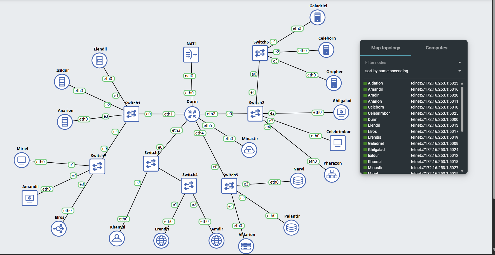

> btw ini topologi di server ardhi, karena saat itu servernya down 😭

Ini dicapai dengan dua aksi utama:

1.  **Memberi Alamat IP**: Mengatur IP statis, _netmask_, dan _gateway_ untuk setiap node.
2.  **Memberi Akses Internet**: Mengkonfigurasi **Durin** sebagai gerbang NAT dan mengatur DNS _resolver_ di semua node lain agar menunjuk ke _nameserver_ GNS3 (`192.168.122.1`).

### Cara Mengerjakan

1.  **Konfigurasi Jaringan Node**: File `/etc/network/interfaces` di **setiap node** (termasuk Durin) diatur untuk menetapkan alamat IP statis, _netmask_, dan _gateway_ yang sesuai dengan topologi.
2.  **Konfigurasi IP Sementara**: Untuk node yang nantinya akan menjadi klien DHCP (Amandil, Gilgalad, Khamul), kita tetap memberikan IP statis sementara agar mereka bisa terhubung ke internet untuk instalasi awal.
3.  **Konfigurasi Router (Durin)**: File `/root/.bashrc` di Durin diedit untuk menambahkan perintah `iptables` yang mengaktifkan **NAT (Network Address Translation)**. Ini memungkinkan Durin meneruskan paket dari jaringan internal ke internet.
4.  **Konfigurasi Klien (Semua Node Lain)**: File `/root/.bashrc` di **semua 19 node lainnya** diedit untuk menambahkan perintah `echo "nameserver 192.168.122.1" > /etc/resolv.conf`. Ini memastikan semua node tahu ke mana harus bertanya untuk resolusi DNS.
5.  **Restart & Aktivasi**: Setelah semua file konfigurasi diatur, semua node di-**Stop** lalu di-**Start** dari GNS3 untuk menerapkan pengaturan `/etc/network/interfaces`. Setelah itu, login ke setiap node dan menjalankan `source /root/.bashrc` untuk mengaktifkan NAT (di Durin) dan DNS (di klien).

### Cara Melakukan Validasi

1.  **Tes Koneksi Internal**: Login ke salah satu node (misalnya **Durin**) dan lakukan `ping` ke alamat IP node di subnet lain (contoh: `ping 10.91.4.2` untuk Aldarion atau `ping 10.91.2.7` untuk Gilgalad). Jika ada balasan, routing internal melalui Durin berhasil.
    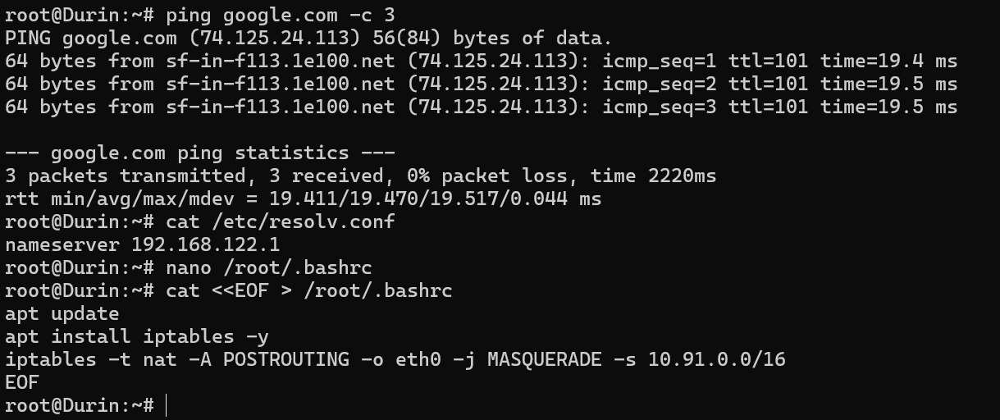

2.  **Tes Koneksi Internet**: Login ke node klien (misalnya **Elendil**), jalankan `source /root/.bashrc`. Perintah `ping google.com -c 2` yang ada di dalam skrip akan otomatis berjalan. Jika `ping` berhasil, ini membuktikan bahwa NAT di Durin dan DNS _resolver_ di Elendil berfungsi dengan benar.
    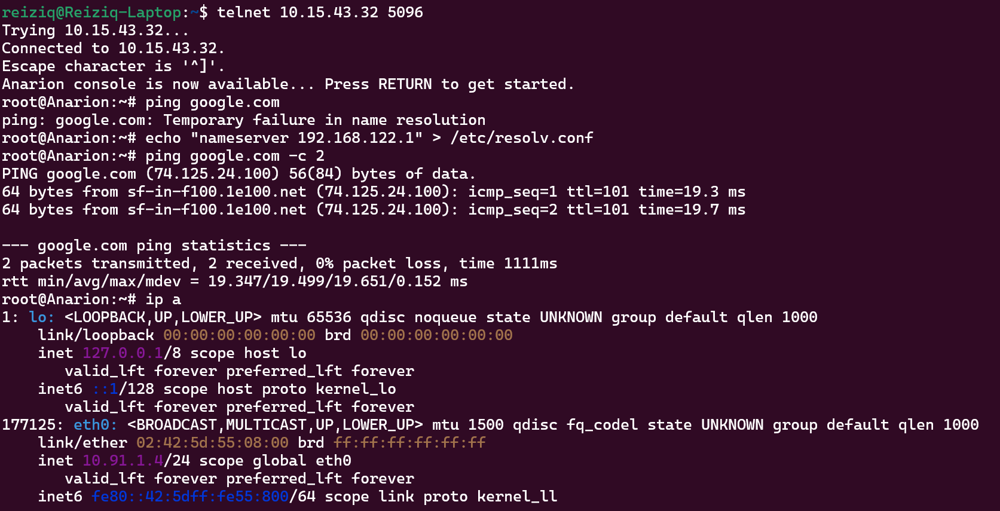

---

## 📦 Soal 2: DHCP Server & Relay

### **Soal 2: Penyampaian Ulang**

> Raja Pelaut Aldarion, penguasa wilayah Númenor, memutuskan cara pembagian tanah client secara dinamis. Ia menetapkan:
>
> - Client Dinamis Keluarga Manusia: Mendapatkan tanah di rentang `[prefix ip].1.6` - `[prefix ip].1.34` dan `[prefix ip].1.68` - `[prefix ip].1.94`.
> - Client Dinamis Keluarga Peri: Mendapatkan tanah di rentang `[prefix ip].2.35` - `[prefix ip].2.67` dan `[prefix ip].2.96` - `[prefix ip].2.121`.
> - Khamul yang misterius: Diberikan tanah tetap di `[prefix ip].3.95`, agar keberadaannya selalu diketahui.
>
> Pastikan **Durin** dapat menyampaikan dekrit ini ke semua wilayah yang terhubung dengannya.

### **🎯 Maksud dari Soal No. 2**

Tujuan dari soal ini adalah mengimplementasikan sistem pembagian alamat IP otomatis menggunakan DHCP (_Dynamic Host Configuration Protocol_). Karena klien (Amandil, Gilgalad, Khamul) dan server (Aldarion) berada di jaringan yang berbeda, kita perlu membangun sistem yang lengkap:

1.  **DHCP Server (Aldarion)**: Mengkonfigurasi **Aldarion** untuk menjadi "otak" yang mengelola dan membagikan alamat IP dari daftar (_pool_) yang telah ditentukan.
2.  **DHCP Relay (Durin)**: Mengkonfigurasi **Durin** untuk bertindak sebagai perantara. Durin akan "mendengarkan" permintaan IP di jaringan klien dan meneruskannya (_relay_) ke Aldarion, lalu mengembalikan jawaban dari Aldarion ke klien yang tepat.
3.  **Fixed Address (Khamul)**: Menerapkan aturan khusus di server DHCP agar **Khamul** (berdasarkan MAC address-nya) selalu diberikan alamat IP yang sama (`10.91.3.95`), meskipun konfigurasinya di sisi klien tetap `dhcp`.

### **🛠️ Cara Mengerjakan**

1.  **Konfigurasi DHCP Server (Aldarion)**:

    - Install paket `isc-dhcp-server`.
    - Edit file `/etc/default/isc-dhcp-server` untuk menentukan `INTERFACESv4="eth0"`.
    - Edit file `/etc/dhcp/dhcpd.conf` untuk:
      _ Mendefinisikan `subnet` untuk setiap jaringan klien (`10.91.1.0/24`, `10.91.2.0/24`, `10.91.3.0/24`).
      _ Menambahkan `range` IP yang sesuai untuk subnet "Keluarga Manusia" dan "Keluarga Peri".

      - Menambahkan `subnet` untuk jaringan `10.91.4.0/24` (tempat Aldarion berada) agar _service_ bisa berjalan.
      - Menambahkan blok `host Khamul` untuk menetapkan _Fixed Address_ berdasarkan MAC address `eth0` Khamul.
        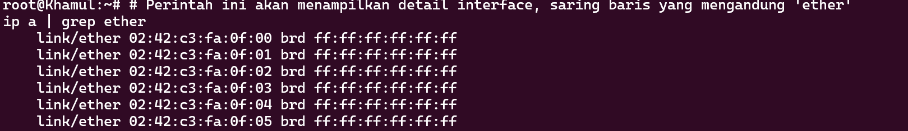

    - Restart _service_ `isc-dhcp-server`.
      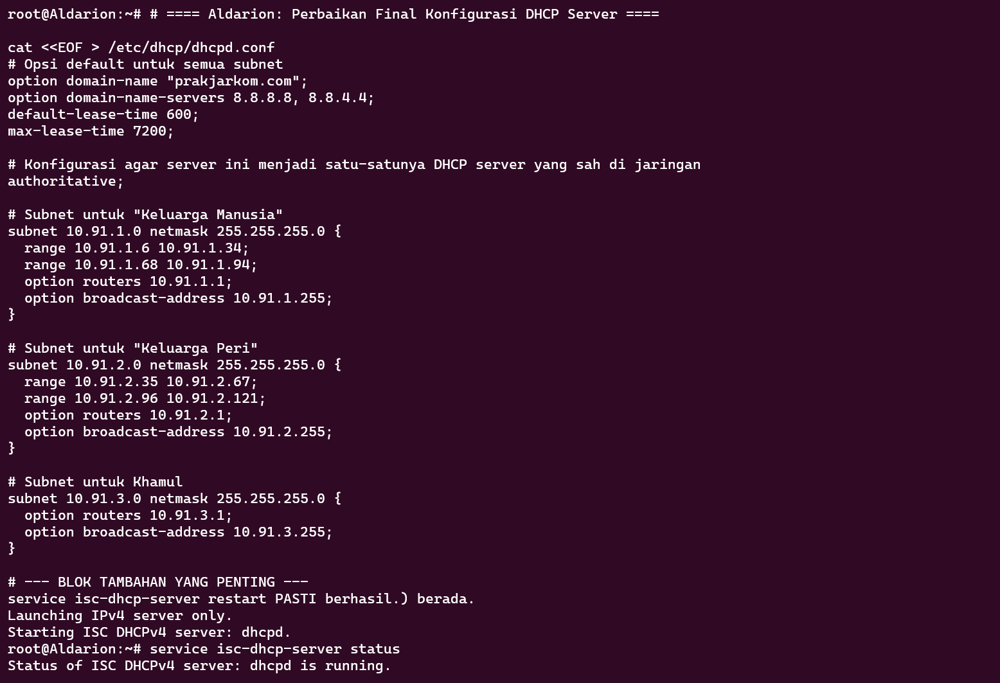

2.  **Konfigurasi DHCP Relay (Durin)**:

    - Install paket `isc-dhcp-relay`.
    - Edit file `/etc/default/isc-dhcp-relay` untuk:
      - Mengatur `SERVERS="10.91.4.2"` (alamat IP Aldarion).
      - Mengatur `INTERFACES="eth1 eth2 eth3 eth4"` (semua _interface_ yang terlibat, baik ke klien maupun ke server).
    - Aktifkan _IP Forwarding_ dengan mengedit file `/etc/sysctl.conf` dan menjalankan `sysctl -p`.
    - Restart _service_ `isc-dhcp-relay`.

3.  **Konfigurasi Klien (Khamul, Amandil, Gilgalad)**:
    - Pada ketiga node ini, ubah file `/etc/network/interfaces` dari `inet static` menjadi `inet dhcp`.
      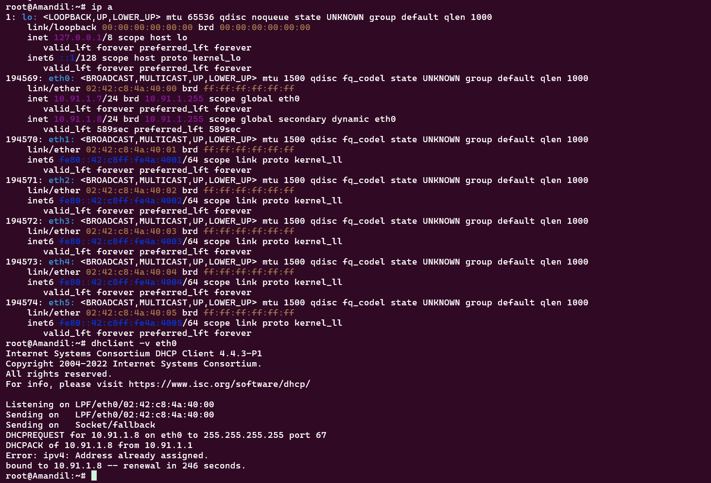
      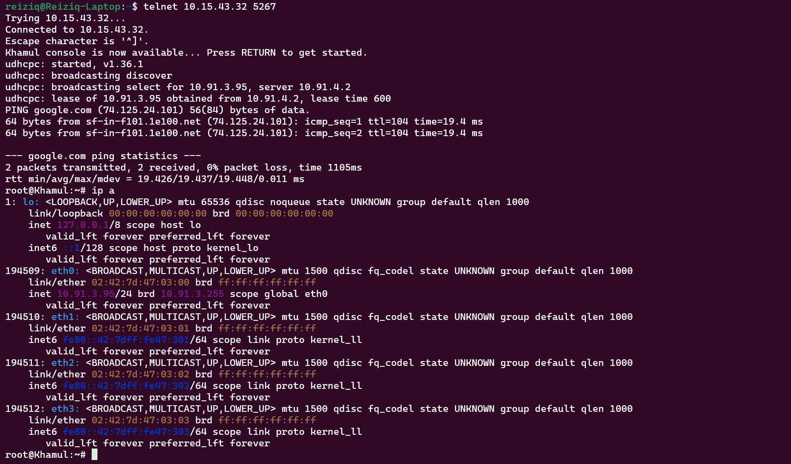

### **✅ Cara Melakukan Validasi**

1.  **Verifikasi Layanan**:
    - Di **Aldarion**, jalankan `service isc-dhcp-server status` untuk memastikan _service_ berjalan (`dhcpd is running`).
    - Di **Durin**, jalankan `ps aux | grep dhcrelay` untuk memastikan proses _relay_ aktif.
2.  **Verifikasi Klien**:
    - **Restart penuh** node **Khamul**, **Amandil**, dan **Gilgalad** satu per satu dari antarmuka GNS3 (**Stop**, lalu **Start**).
    - Buka konsol setiap klien tersebut dan jalankan `ip a`.
3.  **Periksa Hasil**:

    - **Khamul** harus mendapatkan alamat `inet 10.91.3.95/24`.
    - **Amandil** harus mendapatkan alamat `inet` dari rentang `10.91.1.x` yang telah ditentukan.
    - **Gilgalad** harus mendapatkan alamat `inet` dari rentang `10.91.2.x` yang telah ditentukan.

    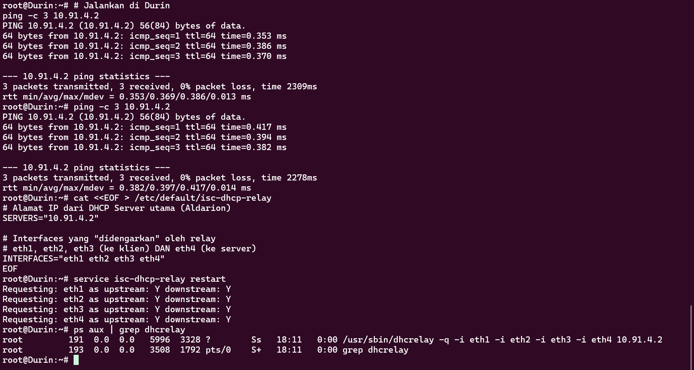

---

## 📦 Soal 3: DNS Forwarder (Minastir)

### **Soal 3: Penyampaian Ulang**

> Untuk mengontrol arus informasi ke dunia luar (Valinor/Internet), sebuah menara pengawas, **Minastir** didirikan. Minastir mengatur agar semua node (kecuali Durin) hanya dapat mengirim pesan ke luar Arda setelah melewati pemeriksaan di Minastir.

### **🎯 Maksud dari Soal No. 3**

Tujuan dari soal ini adalah untuk mengubah alur resolusi DNS di seluruh jaringan. Kita akan menjadikan **Minastir** sebagai **DNS Forwarder**.

Artinya, semua node lain (klien statis dan dinamis) yang ingin mengetahui alamat IP dari sebuah domain (misalnya `google.com`) tidak akan lagi bertanya langsung ke internet (`192.168.122.1`), melainkan harus bertanya ke Minastir (`10.91.5.2`). Minastir kemudian akan meneruskan (_forward_) permintaan tersebut ke server DNS di internet, menerima jawabannya, lalu mengirimkan jawaban itu kembali ke node yang bertanya.

### **🛠️ Cara Mengerjakan**

1.  **Konfigurasi Minastir (DNS Forwarder)**:

    - Install paket `bind9`.
    - Edit file `/etc/bind/named.conf.options` untuk mengaktifkan `listen-on { any; }` (agar mau menerima koneksi dari jaringan), `allow-recursion { ... 10.91.0.0/16; }` (agar mau bekerja untuk jaringan internal kita), dan `forwarders { 192.168.122.1; }` (agar tahu ke mana harus meneruskan permintaan).
    - Ubah file `/etc/resolv.conf` milik Minastir sendiri ke `192.168.122.1` untuk mencegah _looping_.
    - Restart _service_ `named`.

    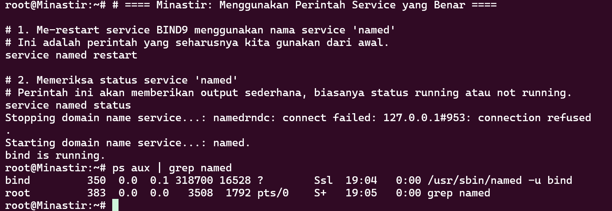

2.  **Konfigurasi Ulang Aldarion (DHCP Server)**:

    - Edit file `/etc/dhcp/dhcpd.conf` di Aldarion.
    - Ubah nilai `option domain-name-servers` dari yang lama menjadi alamat IP Minastir (`10.91.5.2`). Ini akan secara otomatis memberitahu semua klien dinamis untuk menggunakan Minastir.
    - Restart _service_ `isc-dhcp-server` untuk menerapkan perubahan.

3.  **Konfigurasi Ulang Klien Dinamis (Khamul, Amandil, Gilgalad)**:

    - Hapus baris `echo "nameserver 192.168.122.1" ...` dari file `/root/.bashrc` mereka. Ini penting agar skrip `.bashrc` tidak menimpa konfigurasi DNS yang didapat dari DHCP.

4.  **Konfigurasi Ulang Klien Statis (Elendil, Isildur, dll.)**:
    - Edit file `/root/.bashrc` di semua node ini.
    - Ganti baris `echo "nameserver 192.168.122.1" ...` dengan `echo "nameserver 10.91.5.2" > /etc/resolv.conf`.
    - Jalankan `source /root/.bashrc` di setiap node tersebut untuk menerapkan perubahan.

### **✅ Cara Melakukan Validasi**

1.  **Validasi Klien Statis (Contoh: Elendil)**:

    - Setelah menjalankan `source /root/.bashrc`, jalankan `cat /etc/resolv.conf`. Pastikan outputnya adalah `nameserver 10.91.5.2`.
    - Lakukan tes `ping google.com`. Jika berhasil, validasi sukses.

    
    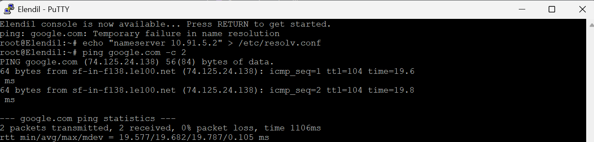

2.  **Validasi Klien Dinamis (Contoh: Khamul)**:

    - **Restart penuh node Khamul** dari antarmuka GNS3 (**Stop**, lalu **Start**).
    - Setelah node menyala, login dan jalankan `cat /etc/resolv.conf`. Outputnya **harus** `nameserver 10.91.5.2` (ini didapat secara otomatis dari Aldarion).
    - Lakukan tes `ping google.com`. Jika berhasil, validasi sukses.

    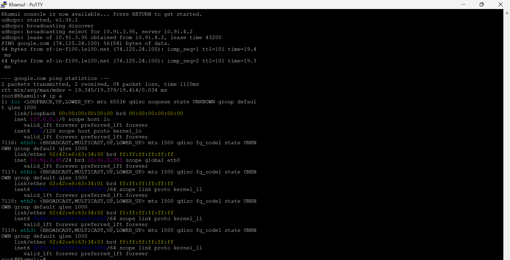

---

## 📦 Soal 4: DNS Master-Slave (Erendis & Amdir)

### **Soal 4: Penyampaian Ulang**

> Ratu Erendis, sang pembuat peta, menetapkan nama resmi untuk wilayah utama (`K55.com`). Ia menunjuk dirinya (`ns1.K55.com`) dan muridnya Amdir (`ns2.K55.com`) sebagai penjaga peta resmi. Setiap lokasi penting (Palantir, Elros, Pharazon, Elendil, Isildur, Anarion, Galadriel, Celeborn, Oropher) diberikan nama domain unik yang menunjuk ke lokasi fisik tanah mereka. Pastikan Amdir selalu menyalin peta (_master-slave_) dari Erendis dengan setia.

### **🎯 Maksud dari Soal No. 4**

Tujuan dari soal ini adalah membangun sistem DNS internal kita sendiri untuk mengelola domain `K55.com`. Ini menggantikan peran Minastir sebagai _forwarder_ sederhana.

1.  **Erendis sebagai DNS Master Server**: Erendis dikonfigurasi sebagai sumber utama ("master") yang menyimpan _database_ (disebut _zone file_) yang memetakan semua nama domain (`elros.K55.com`) ke alamat IP (`10.91.1.6`).
2.  **Amdir sebagai DNS Slave Server**: Amdir dikonfigurasi sebagai server cadangan ("slave"). Ia akan secara otomatis menyalin seluruh _database_ dari Erendis. Ini adalah mekanisme replikasi yang penting untuk ketersediaan layanan (jika Erendis mati, Amdir bisa mengambil alih).
3.  **Pembaruan Klien**: Semua node di jaringan (baik statis maupun dinamis) harus diperbarui agar tidak lagi bertanya ke Minastir, melainkan bertanya ke Erendis (`10.91.3.2`) dan Amdir (`10.91.3.3`).

### **🛠️ Cara Mengerjakan**

1.  **Konfigurasi Erendis (Master)**:

    - Install `bind9`.
    - Edit file `/etc/bind/named.conf.options` untuk mengizinkan _query_, _recursion_, dan `allow-transfer` ke Amdir.
    - Edit file `/etc/bind/named.conf.local` untuk mendeklarasikan _zone_ `K55.com` sebagai `type master`.
    - Buat file _zone_ `/etc/bind/jarkom/K55.com` yang berisi semua _record_ SOA, NS, dan A untuk semua _host_ yang diminta.
    - Restart _service_ `named`.

    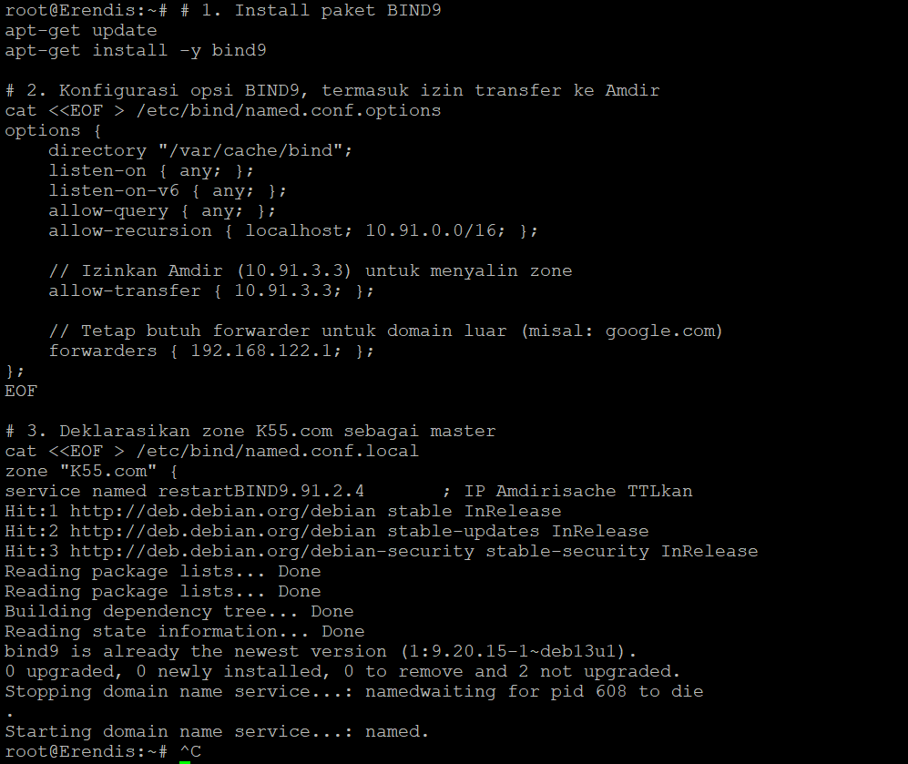

2.  **Konfigurasi Amdir (Slave)**:

    - Install `bind9`.
    - Edit file `/etc/bind/named.conf.options` untuk mengizinkan _query_ dan _recursion_.
    - Edit file `/etc/bind/named.conf.local` untuk mendeklarasikan _zone_ `K55.com` sebagai `type slave`, menunjuk ke `masters { 10.91.3.2; }` (IP Erendis).
    - Restart _service_ `named`.

    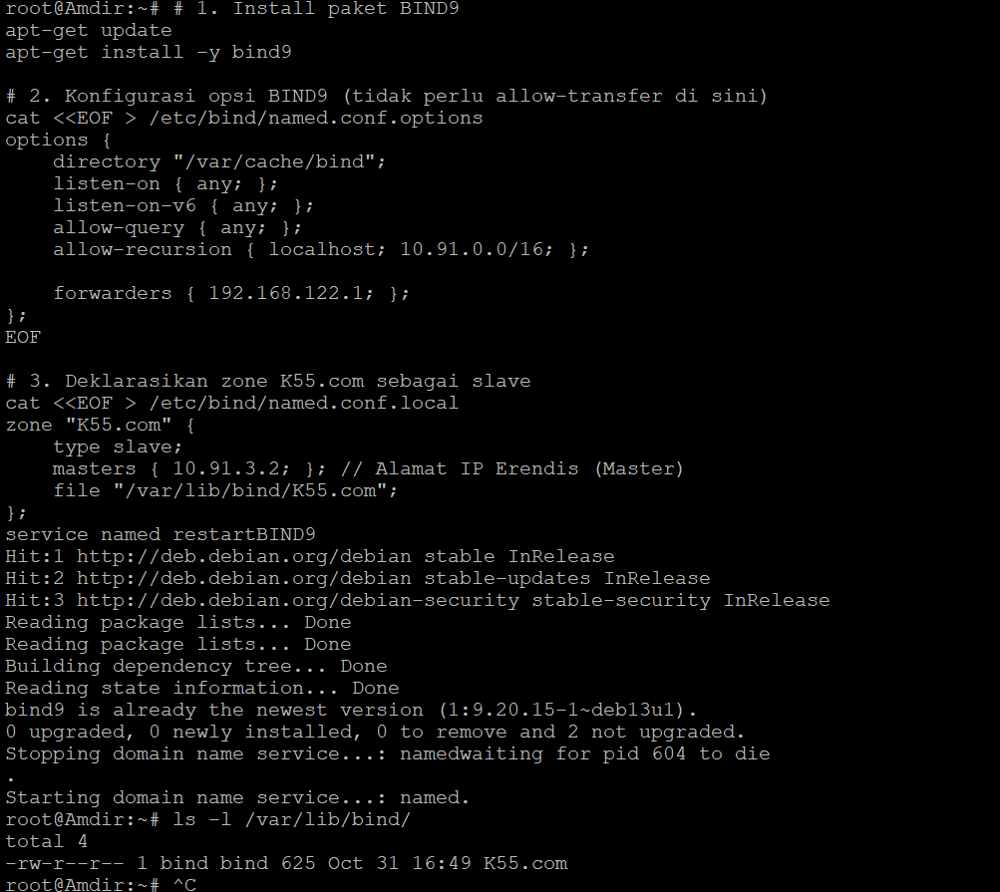

3.  **Konfigurasi Ulang Klien Dinamis**:

    - Edit file `/etc/dhcp/dhcpd.conf` di **Aldarion**.
    - Ubah baris `option domain-name-servers` agar sekarang berisi IP Erendis dan Amdir (`10.91.3.2, 10.91.3.3`).
    - Restart _service_ `isc-dhcp-server`.

    

4.  **Konfigurasi Ulang Klien Statis**:
    - Di semua node statis (Elendil, Minastir, Palantir, dll.), edit file `/root/.bashrc`.
    - Hapus baris lama yang menunjuk ke Minastir.
    - Tambahkan baris baru: `echo -e "nameserver 10.91.3.2\nnameserver 10.91.3.3" > /etc/resolv.conf`.
    - Jalankan `source /root/.bashrc` untuk menerapkan perubahan.

### **✅ Cara Melakukan Validasi**

1.  **Validasi Replikasi (di Amdir)**:

    - Jalankan `ls -l /var/lib/bind/` di Amdir. Pastikan file `K55.com` telah berhasil dibuat. Ini membuktikan _zone transfer_ dari Erendis berhasil.
    - (Dapat dilihat pada gambar konfigurasi Amdir di atas)

2.  **Validasi Klien Statis (di Elendil)**:

    - Jalankan `cat /etc/resolv.conf` untuk memastikan _nameserver_ telah menunjuk ke Erendis dan Amdir.
    - Tes resolusi internal: `host elros.K55.com`. Pastikan hasilnya adalah `10.91.1.6`.
    - Tes resolusi eksternal: `ping google.com -c 2`. Pastikan _forwarding_ masih berfungsi.

    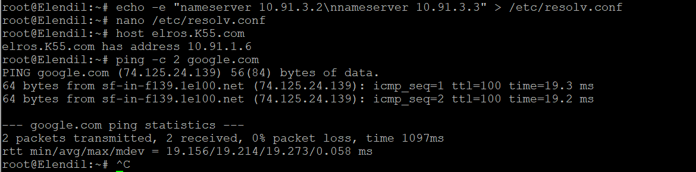

3.  **Validasi Klien Dinamis (di Khamul)**:

    - **Restart penuh node Khamul** dari GNS3 (Stop, lalu Start).
    - Jalankan `cat /etc/resolv.conf`. Pastikan `nameserver 10.91.3.2` dan `nameserver 10.91.3.3` muncul **secara otomatis**.
    - Tes resolusi internal: `host pharazon.K55.com`.

    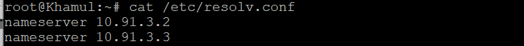

---

## 📦 Soal 5: Menambahkan Record CNAME, PTR, dan TXT

### **Soal 5: Penyampaian Ulang**

> Untuk memudahkan, nama alias `www.K55.com` dibuat untuk peta utama `K55.com`. **Reverse PTR** juga dibuat agar lokasi Erendis dan Amdir dapat dilacak dari alamat fisik tanahnya. Erendis juga menambahkan pesan rahasia (**TXT record**) pada petanya: "Cincin Sauron" yang menunjuk ke lokasi Elros, dan "Aliansi Terakhir" yang menunjuk ke lokasi Pharazon. Pastikan Amdir juga mengetahui pesan rahasia ini.

### **🎯 Maksud dari Soal No. 5**

Soal ini meminta kita untuk menambahkan tiga jenis _record_ DNS baru di server master (**Erendis**). Karena Amdir adalah _slave_, semua perubahan ini akan **otomatis tersalin** kepadanya.

1.  **CNAME (Canonical Name)**: Ini adalah "nama panggilan" atau alias. Kita akan membuat `www.K55.com` sebagai alias yang akan menunjuk ke `K55.com`.
2.  **PTR (Pointer Record)**: Ini adalah kebalikan dari _record A_ (yang memetakan Nama ke IP). PTR memetakan **IP ke Nama**. Ini sering disebut _Reverse DNS_ atau _reverse lookup_, dan berguna untuk "mencari tahu siapa pemilik" sebuah alamat IP.
3.  **TXT (Text Record)**: Ini adalah _record_ yang memungkinkan kita menyimpan teks biasa di dalam DNS untuk "pesan rahasia".

### **🛠️ Cara Mengerjakan**

Seluruh konfigurasi untuk soal ini hanya dilakukan di **Erendis (Master Server)**.

1.  **Deklarasikan Reverse Zone**: Di file `/etc/bind/named.conf.local`, kita mendeklarasikan zona baru untuk _reverse lookup_ jaringan `10.91.3.0/24`. Nama zona ini memiliki format khusus: `3.91.10.in-addr.arpa`.

    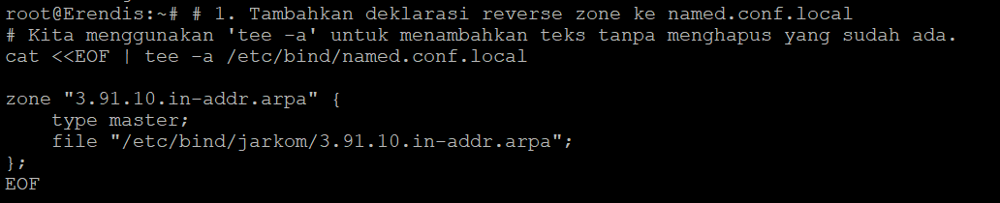

2.  **Buat Zone File**: Kita membuat file baru (`/etc/bind/jarkom/3.91.10.in-addr.arpa`) yang berisi pemetaan PTR untuk Erendis dan Amdir.
3.  **Perbarui Zone File**: Kita mengedit file `K55.com` yang sudah ada untuk menambahkan _record_ CNAME (`www`) dan dua _record_ TXT.
4.  **Restart BIND9**: Terapkan semua perubahan dengan me-restart _service_ `named` di Erendis.

    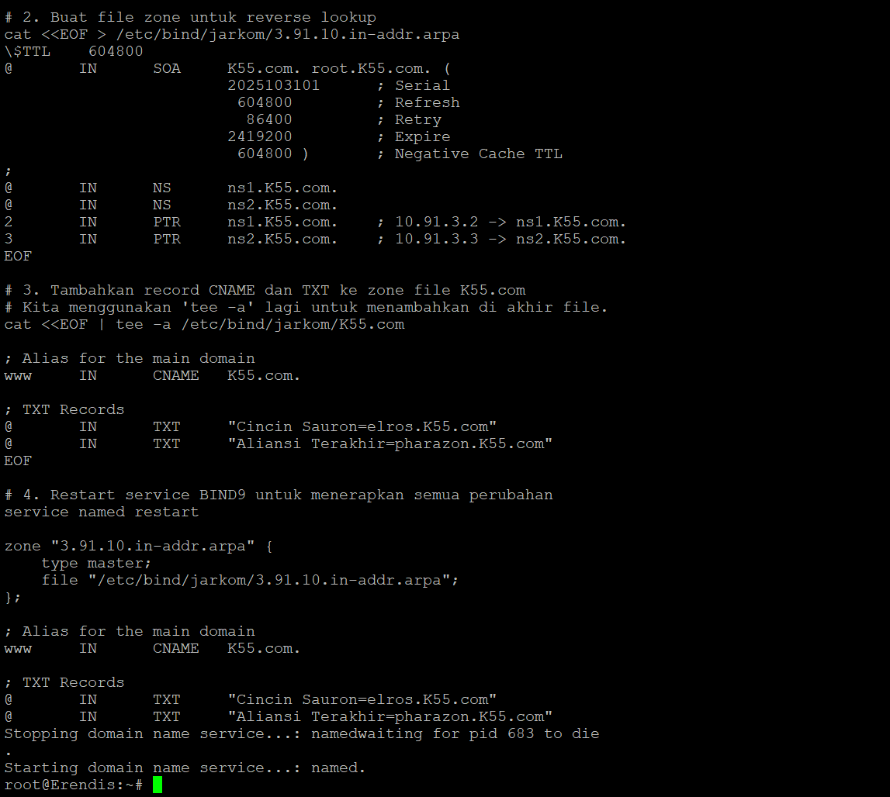

### **✅ Cara Melakukan Validasi**

Setelah menjalankan skrip di **Erendis**, kita bisa langsung melakukan validasi dari klien mana pun (misalnya, **Elendil** atau **Khamul**) yang sudah menggunakan Erendis/Amdir sebagai DNS servernya.

1.  **Validasi CNAME**:
    - Jalankan `host www.K55.com`.
    - Hasil: `www.K55.com is an alias for K55.com.`
2.  **Validasi PTR (Reverse Lookup)**:
    - Jalankan `host 10.91.3.2`.
    - Hasil: `2.3.91.10.in-addr.arpa domain name pointer ns1.K55.com.`
3.  **Validasi TXT**:
    - Jalankan `host -t TXT K55.com`.
    - Hasil: Menampilkan kedua _record_ TXT, "Cincin Sauron..." dan "Aliansi Terakhir...".

Semua validasi ini berhasil dilakukan dari klien, yang membuktikan bahwa konfigurasi telah berhasil diterapkan dan disalin ke _slave_.

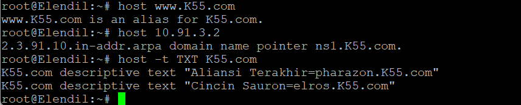

---

## 📦 Soal 6: Konfigurasi DHCP Lease Time

### **Soal 6: Penyampaian Ulang**

> Aldarion menetapkan aturan waktu peminjaman tanah. Ia mengatur:
>
> - Client Dinamis Keluarga Manusia dapat meminjam tanah selama **setengah jam**.
> - Client Dinamis Keluarga Peri hanya **seperenam jam**.
> - Batas waktu maksimal peminjaman untuk semua adalah **satu jam**.

### **🎯 Maksud dari Soal No. 6**

Tujuan dari soal ini adalah untuk mengatur **durasi peminjaman alamat IP** (_Lease Time_) yang dibagikan oleh server DHCP **Aldarion**. Kita perlu menetapkan durasi yang berbeda untuk subnet yang berbeda sesuai permintaan soal.

- Setengah jam = 30 menit = **1800 detik**
- Seperenam jam = 10 menit = **600 detik**
- Satu jam = 60 menit = **3600 detik**

Ini dilakukan untuk mengontrol seberapa lama sebuah klien dapat "memegang" sebuah alamat IP sebelum harus melapor kembali ke server untuk memperpanjangnya.

### **🛠️ Cara Mengerjakan**

Seluruh konfigurasi untuk soal ini hanya dilakukan di **Aldarion (DHCP Server)**.

1.  Edit file konfigurasi `/etc/dhcp/dhcpd.conf`.
2.  Di dalam blok `subnet 10.91.1.0` (Keluarga Manusia), tambahkan direktif `default-lease-time 1800;` dan `max-lease-time 3600;`.
3.  Di dalam blok `subnet 10.91.2.0` (Keluarga Peri), tambahkan direktif `default-lease-time 600;` dan `max-lease-time 3600;`.
4.  Pastikan tidak ada _syntax error_ akibat kesalahan salin-tempel (masalah yang sering terjadi sebelumnya).
5.  Restart _service_ `isc-dhcp-server` untuk menerapkan semua perubahan konfigurasi.

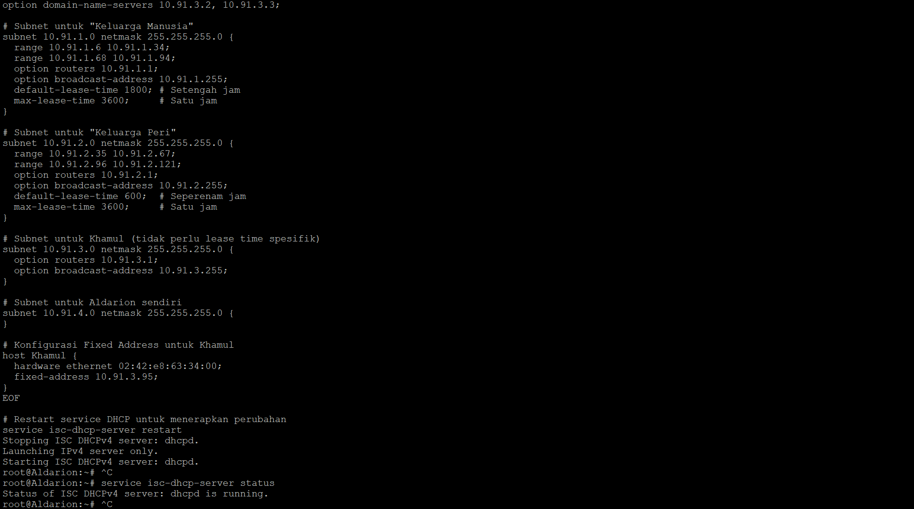

### **✅ Cara Melakukan Validasi**

1.  **Validasi Server**: Di **Aldarion**, jalankan `service isc-dhcp-server status` untuk memastikan _service_ `dhcpd is running`. Ini membuktikan bahwa file konfigurasi baru kita valid dan telah berhasil dimuat.
2.  **Validasi Klien (Keluarga Manusia)**:
    - **Restart penuh node Amandil** dari antarmuka GNS3 (**Stop**, lalu **Start**).
    - Saat node _booting_, perhatikan log `udhcpc`. Log harus menunjukkan `lease time 1800`.
3.  **Validasi Klien (Keluarga Peri)**:
    - **Restart penuh node Gilgalad** dari GNS3.
    - Saat node _booting_, log `udhcpc` harus menunjukkan `lease time 600`.

Hasil validasi di Amandil menunjukkan _lease time_ yang benar, yaitu 1800 detik, yang membuktikan bahwa konfigurasi telah berhasil diterapkan.

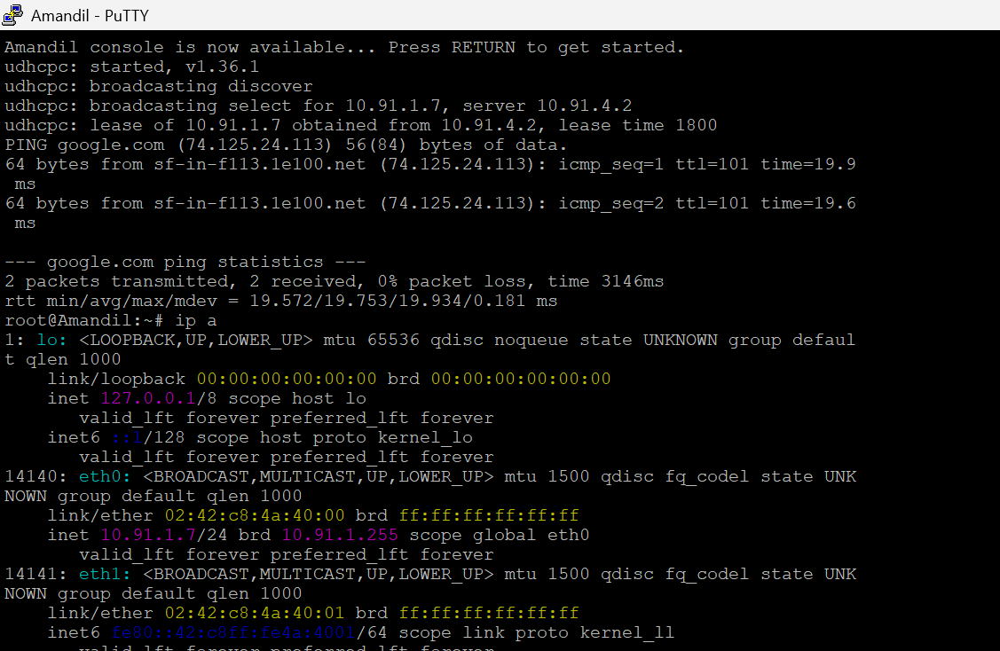

---

## 📦 Soal 7: Setup Worker Laravel (Elendil, Isildur, Anarion)

### **Soal 7: Penyampaian Ulang**

> Para Ksatria Númenor (Elendil, Isildur, Anarion) mulai membangun benteng pertahanan digital mereka menggunakan teknologi Laravel. Instal semua _tools_ yang dibutuhkan (`php8.4`, `composer`, `nginx`) dan dapatkan cetak biru benteng dari `Resource-laravel` di setiap node _worker_ Laravel. Cek dengan `lynx` di client.

### **🎯 Maksud dari Soal No. 7**

Tujuan dari soal ini adalah melakukan instalasi dan konfigurasi lengkap pada tiga node _worker_ kita: **Elendil, Isildur, dan Anarion**. Masing-masing node ini akan disiapkan sebagai _server_ web independen yang menjalankan aplikasi Laravel. Ini adalah langkah persiapan fondasi sebelum kita menghubungkan mereka ke _database_ dan _load balancer_ di soal-soal berikutnya.

### **🛠️ Cara Mengerjakan**

Proses ini diulangi di ketiga node _worker_ (Elendil, Isildur, Anarion).

1.  **Installasi Paket**: Pertama, kita menambahkan repositori `sury.org` untuk mendapatkan versi PHP yang spesifik. Kemudian, kita menginstall semua paket yang dibutuhkan, termasuk `nginx`, `git`, `composer`, dan `php8.4` beserta ekstensi-ekstensinya.
2.  **Unduh Aplikasi Laravel**: Berpindah ke direktori `/var/www` dan menggunakan `git clone` untuk mengunduh kode aplikasi dari repositori `laravel-simple-rest-api`.
3.  **Install Dependensi (Perbaikan)**:
    - Saat menjalankan `composer install`, terjadi error karena `composer.lock` dari repositori tersebut meminta paket-paket lama yang tidak kompatibel dengan PHP 8.4.
    - **Solusi**: Sebagai gantinya, kita menjalankan `composer update`. Perintah ini akan mengabaikan file `.lock` dan mengunduh versi terbaru dari semua paket yang kompatibel dengan PHP 8.4.
4.  **Konfigurasi Dasar Laravel**: Menyalin file `.env.example` menjadi `.env` dan menjalankan `php artisan key:generate` untuk membuat kunci enkripsi aplikasi.
5.  **Konfigurasi Nginx**: Membuat file konfigurasi _server block_ baru di `/etc/nginx/sites-available/laravel`. Di dalam file ini, kita mengatur `root` ke direktori `.../public` aplikasi Laravel dan mengatur `listen` pada port yang unik untuk setiap _worker_ (Elendil: 8001, Isildur: 8002, Anarion: 8003).
6.  **Finalisasi**: Mengaktifkan situs Nginx yang baru dengan membuat _symlink_ ke `sites-enabled` dan menghapus konfigurasi _default_. Izin akses folder `storage` juga diatur, lalu _service_ `php8.4-fpm` dan `nginx` dijalankan.

### **✅ Cara Melakukan Validasi**

1.  **Install Lynx**: Di node klien (misalnya **Miriel**), install `lynx` untuk melakukan tes berbasis teks.
2.  **Akses Setiap Worker**: Gunakan `lynx` untuk mengakses setiap _worker_ melalui alamat IP dan port-nya masing-masing.
    - `lynx http://10.91.1.2:8001` (Elendil)
    - `lynx http://10.91.1.3:8002` (Isildur)
    - `lynx http://10.91.1.4:8003` (Anarion)
3.  **Periksa Hasil**: Validasi dianggap **berhasil** jika `lynx` menampilkan halaman selamat datang Laravel, bukan halaman error "500 Internal Server Error".

    

---

## 📦 Soal 8: Koneksi Database & Pembatasan Domain

### **Soal 8: Penyampaian Ulang**

> Setiap benteng Númenor harus terhubung ke sumber pengetahuan, **Palantir**. Konfigurasikan koneksi database di file **.env** masing-masing worker. Setiap benteng juga harus memiliki gerbang masuk yang unik; atur nginx agar **Elendil mendengarkan di port 8001, Isildur di 8002, dan Anarion di 8003**. Jangan lupa jalankan **migrasi dan seeding** awal dari **Elendil**. Buat agar akses web hanya bisa melalui **domain nama**, tidak bisa melalui ip.

### **🎯 Maksud dari Soal No. 8**

Tujuan dari soal ini adalah untuk "menghidupkan" aplikasi Laravel yang sudah kita install di Soal 7. Ini dilakukan dengan menghubungkan ketiga _worker_ (Elendil, Isildur, Anarion) ke satu _database server_ pusat, yaitu **Palantir**.

Kita akan melakukan empat hal:

1.  **Menyiapkan Database Pusat**: Mengkonfigurasi **Palantir** (MariaDB) agar siap menerima koneksi dari _worker_.
2.  **Menghubungkan Worker**: Memberi tahu setiap _worker_ (via file `.env`) alamat dan kredensial untuk mengakses _database_ di Palantir.
3.  **Inisialisasi Database**: Menjalankan _migrasi_ (`php artisan migrate`) dari Elendil untuk membangun struktur tabel di Palantir dan _seeding_ (`db:seed`) untuk mengisinya dengan data awal.
4.  **Membatasi Akses**: Mengubah konfigurasi Nginx di setiap _worker_ agar mereka **hanya merespon** jika diakses menggunakan nama domain (misal, `elendil.K55.com`) dan menolak akses via alamat IP (`10.91.1.2`).

### **🛠️ Cara Mengerjakan**

1.  **Konfigurasi Palantir (Database Server)**:

    - Install `mariadb-server`.
    - Membuat _database_ baru (misal, `db_k55`) dan _user_ (misal, `k55_user`) dengan hak akses penuh dari jaringan _worker_.
    - **(Perbaikan Penting)** Mengedit file konfigurasi MariaDB (di `/etc/mysql/mariadb.conf.d/50-server.cnf`) untuk **mengomentari** baris `bind-address = 127.0.0.1`. Ini adalah langkah krusial agar server mau menerima koneksi dari alamat IP lain (Elendil, dkk.), tidak hanya dari `localhost`.
    - Me-restart _service_ `mariadb`.

2.  **Konfigurasi Worker (Elendil, Isildur, & Anarion)**:

    - Pada ketiga node, edit file `/var/www/laravel-simple-rest-api/.env`.
    - Ubah nilai `DB_HOST`, `DB_DATABASE`, `DB_USERNAME`, dan `DB_PASSWORD` agar sesuai dengan yang dibuat di Palantir.

3.  **Migrasi & Seeding (Hanya Elendil)**:

    - Setelah Palantir siap dan `.env` di Elendil terkonfigurasi, kita masuk ke direktori aplikasi di **Elendil**.
    - Menjalankan `php artisan migrate:fresh` untuk membuat semua tabel di _database_ Palantir.
    - Menjalankan `php artisan db:seed --class=AiringsTableSeeder` untuk mengisi data awal ke tabel `airings`.

4.  **Konfigurasi Nginx (Domain Only)**:
    - Di **Elendil**, edit `/etc/nginx/sites-available/laravel` dan ubah `server_name _;` menjadi `server_name elendil.K55.com;`.
    - Di **Isildur**, lakukan hal yang sama, tetapi ubah menjadi `server_name isildur.K55.com;`.
    - Di **Anarion**, lakukan hal yang sama, tetapi ubah menjadi `server_name anarion.K55.com;`.
    - Restart `nginx` di ketiga _worker_.

### **✅ Cara Melakukan Validasi**

1.  **Validasi Database (di Palantir)**:

    - Setelah _service_ MariaDB di-restart, jalankan `netstat -tulpn | grep 3306`.
    - Hasilnya harus menunjukkan bahwa _service_ `mariadbd` mendengarkan di `0.0.0.0:3306` atau `:::3306`, bukan lagi `127.0.0.1:3306`. Ini membuktikan ia siap menerima koneksi jaringan.

    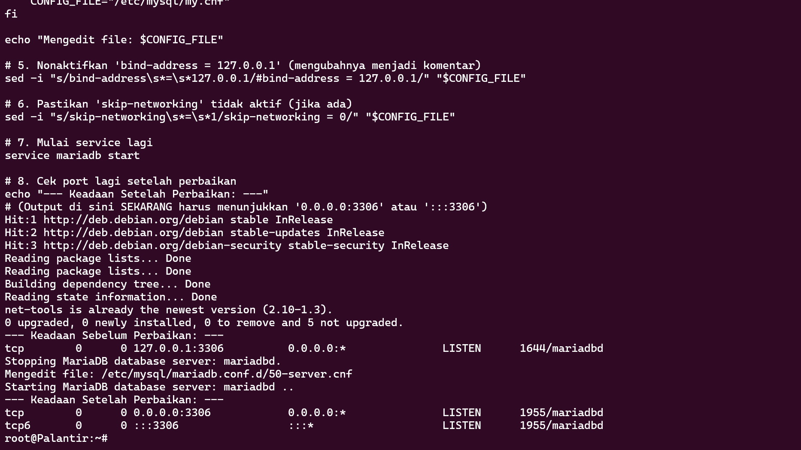

2.  **Validasi Migrasi (di Elendil)**:

    - Periksa output dari `php artisan migrate:fresh`. Perintah ini harus berjalan sukses dengan status `DONE` untuk setiap tabel dan tidak ada error `Connection refused`.

    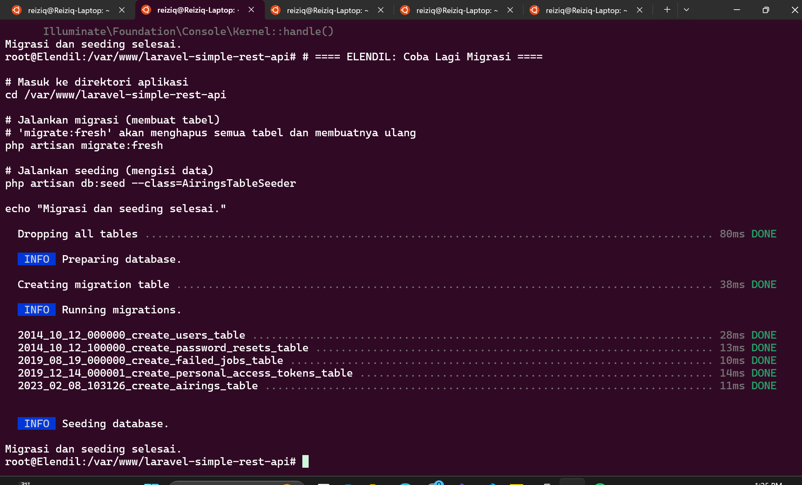

3.  **Validasi Akses Domain (di Klien)**:

    - Buka klien (misal, **Miriel**).
    - Jalankan `lynx http://elendil.K55.com:8001`.
    - Tes ini harus **berhasil** dan menampilkan halaman Laravel, membuktikan Nginx merespon panggilan via domain.

    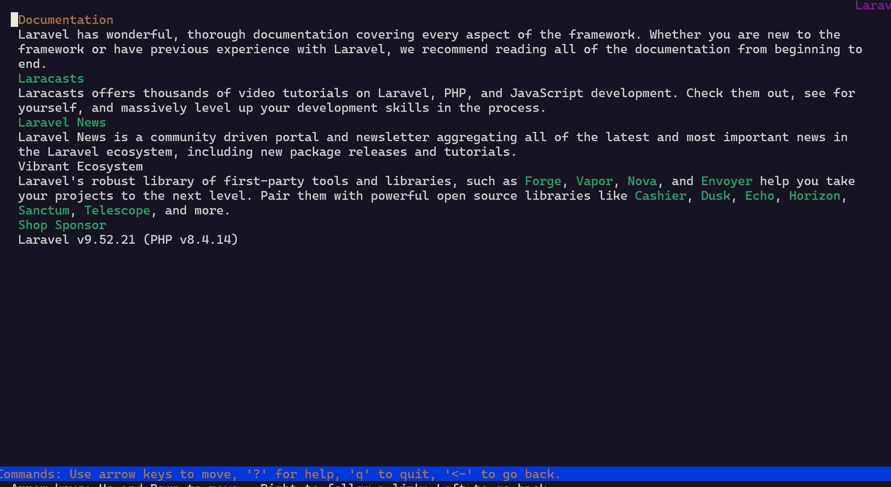

4.  **Validasi Akses IP (di Klien)**:
    - Dari klien yang sama, jalankan `lynx http://10.91.1.2:8001`.
    - Tes ini seharusnya **GAGAL** (misal, menampilkan error 404), membuktikan Nginx sudah tidak merespon panggilan via IP.

---

## 📦 Soal 9: Validasi Worker Laravel dan Database

### **Soal 9: Penyampaian Ulang**

> Pastikan setiap benteng berfungsi secara mandiri. Dari dalam node client masing-masing, gunakan `lynx` untuk melihat halaman utama Laravel dan `curl /api/airing` untuk memastikan mereka bisa mengambil data dari Palantir.

### **🎯 Maksud dari Soal No. 9**

Soal ini adalah langkah pengujian akhir untuk memastikan bahwa semua konfigurasi dari Soal 7 dan 8 telah berhasil. Tujuannya adalah untuk memvalidasi dua hal dari perspektif klien:

1.  **Fungsionalitas Web Server**: Membuktikan bahwa _worker_ (Elendil, Isildur, Anarion) dapat diakses melalui nama domain dan port-nya masing-masing. Ini divalidasi menggunakan `lynx`.
2.  **Konektivitas Database**: Membuktikan bahwa aplikasi Laravel di setiap _worker_ dapat terhubung ke _database_ **Palantir**, mengambil data yang telah di-_seed_, dan menampilkannya. Ini divalidasi menggunakan `curl` ke _endpoint_ API (`/api/airing`).

### **🛠️ Cara Mengerjakan**

Semua langkah pengerjaan pada soal ini adalah perintah validasi yang dijalankan dari **node klien** (misalnya, **Miriel**).

1.  **Siapkan Klien**: Pastikan node klien (Miriel) memiliki _tools_ `lynx` dan `curl` yang sudah terinstall.
2.  **Pastikan DNS Klien**: Pastikan file `/etc/resolv.conf` di Miriel sudah menunjuk ke server DNS Erendis (`10.91.3.2`) dan Amdir (`10.91.3.3`).
3.  **Jalankan Tes `lynx`**: Jalankan `lynx -dump` ke halaman utama setiap _worker_ (misal, `lynx -dump http://isildur.K55.com:8002`) untuk memeriksa apakah _web server_ merespon.
4.  **Jalankan Tes `curl`**: Jalankan `curl` ke _endpoint_ `/api/airing` di setiap _worker_ (misal, `curl http://isildur.K55.com:8002/api/airing`) untuk memeriksa apakah koneksi _database_ berfungsi.

### **✅ Cara Melakukan Validasi**

1.  **Validasi Halaman Utama (`lynx`)**:

    - Perintah `lynx -dump` ke setiap _worker_ (Elendil, Isildur, Anarion) berhasil mengembalikan halaman selamat datang Laravel. Ini membuktikan Soal 7 (setup `nginx`/`php-fpm`) dan bagian pembatasan domain dari Soal 8 berhasil.

    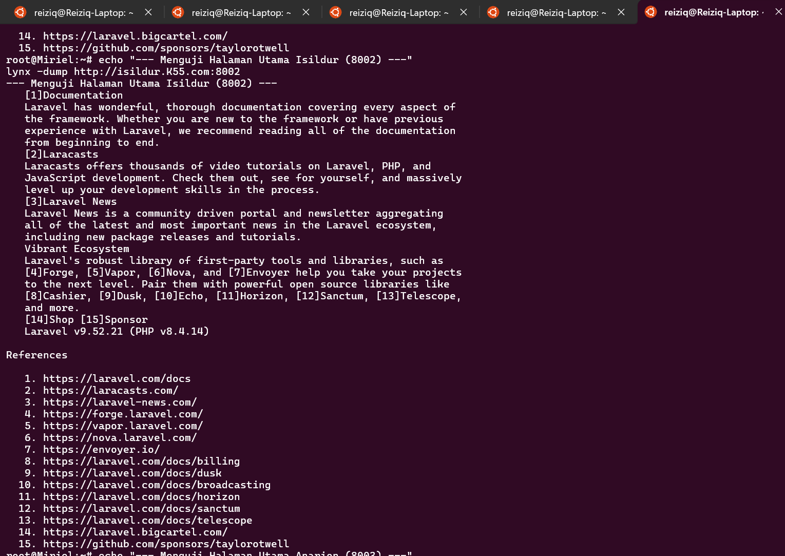

2.  **Validasi API Database (`curl`)**:

    - Perintah `curl` ke _endpoint_ `/api/airing` di setiap _worker_ berhasil mengembalikan data dalam format JSON yang diawali dengan `{"data":[{...` dan diakhiri `,"message":"succeed"}`.
    - Ini adalah bukti mutlak bahwa Soal 8 (konfigurasi `.env`, `bind-address` di Palantir, dan proses `migrate:fresh --seed`) telah **berhasil dengan sukses**.

    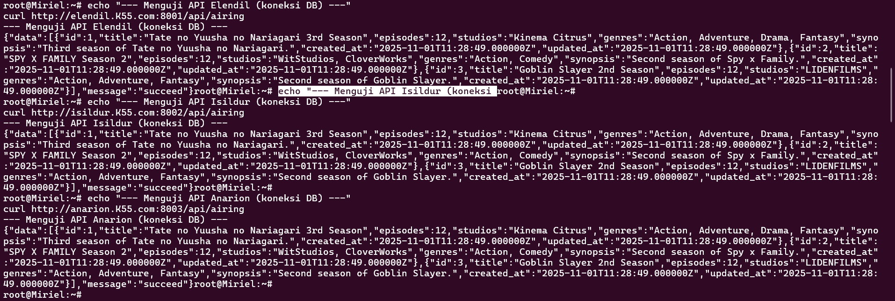

---

## 📦 Soal 10: Konfigurasi Load Balancer (Elros)

### **Soal 10: Penyampaian Ulang**

> Pemimpin bijak Elros ditugaskan untuk mengkoordinasikan pertahanan Númenor. Konfigurasikan nginx di **Elros** untuk bertindak sebagai **reverse proxy**. Buat _upstream_ bernama **kesatria_numenor** yang berisi alamat ketiga _worker_ (Elendil, Isildur, Anarion). Atur agar semua permintaan yang datang ke domain **elros.K55.com** diteruskan secara merata menggunakan algoritma **Round Robin** ke _backend_.

### **🎯 Maksud dari Soal No. 10**

Tujuan dari soal ini adalah untuk menyiapkan **Load Balancer**. Node **Elros** akan bertindak sebagai "gerbang utama" atau _reverse proxy_ untuk ketiga _worker_ Laravel kita.

Daripada klien harus mengingat tiga alamat port yang berbeda (8001, 8002, 8003), mereka sekarang hanya perlu mengakses satu alamat: `http://elros.K55.com`. Elros kemudian akan secara cerdas meneruskan permintaan tersebut ke salah satu dari tiga _worker_ (Elendil, Isildur, atau Anarion) di belakangnya. Algoritma **Round Robin** (standar Nginx) akan memastikan beban didistribusikan secara bergantian ke setiap _worker_.

### **🛠️ Cara Mengerjakan**

Seluruh konfigurasi untuk soal ini hanya dilakukan di node **Elros**.

1.  **Install Nginx**: Paket `nginx` diinstall pada node **Elros**.
2.  **Buat Konfigurasi**: File konfigurasi baru dibuat di `/etc/nginx/sites-available/elros.K55.com`.
3.  **Definisikan Upstream**: Di dalam file tersebut, sebuah blok `upstream kesatria_numenor` dibuat. Blok ini berisi daftar alamat IP dan port dari ketiga _worker_ Laravel (Elendil, Isildur, dan Anarion).
4.  **Konfigurasi Server Block**: Di file yang sama, sebuah `server` block dibuat yang `listen 80` dan merespon `server_name elros.K55.com`.
5.  **Atur Proxy Pass**: `location /` utama dikonfigurasi dengan `proxy_pass http://kesatria_numenor;`. Ini adalah perintah yang memberitahu Nginx untuk meneruskan semua permintaan ke grup _upstream_ yang telah didefinisikan.
6.  **Atur Headers**: Perintah `proxy_set_header` ditambahkan untuk memastikan informasi klien (seperti IP asli) tetap diteruskan ke _worker_.
7.  **Aktifkan Situs**: Konfigurasi baru diaktifkan dengan membuat _symlink_ ke `sites-enabled` dan menghapus konfigurasi _default_.
8.  **Restart Nginx**: _Service_ `nginx` di Elros di-restart untuk menerapkan perubahan.

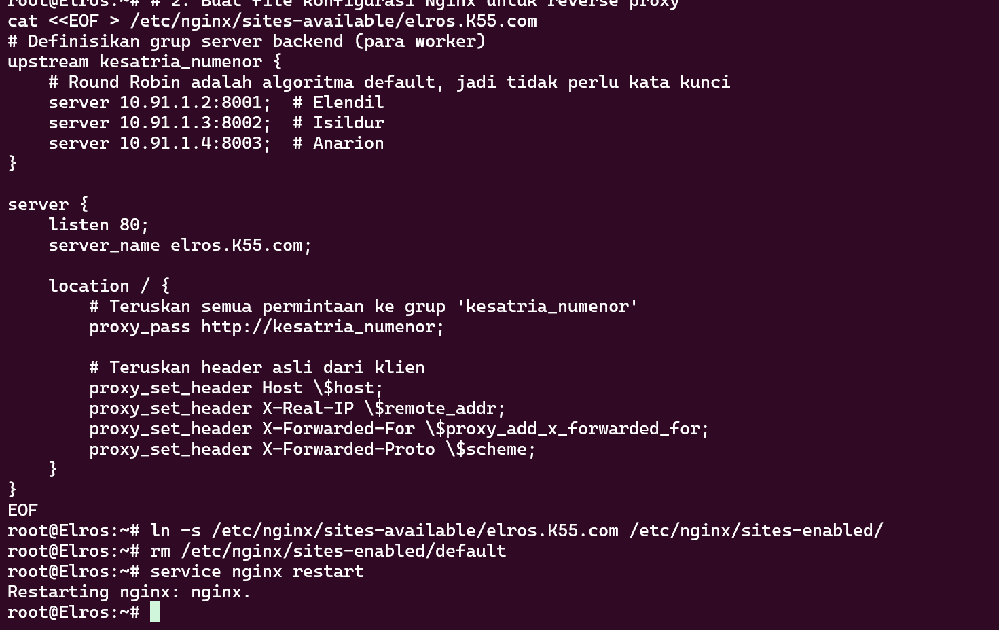

### **✅ Cara Melakukan Validasi**

1.  **Validasi Klien (Miriel)**:

    - Dari node klien (Miriel), jalankan perintah `curl http://elros.K55.com/api/airing` beberapa kali.
    - **Hasil**: Perintah ini **berhasil** dan mengembalikan data JSON. Ini membuktikan bahwa _load balancer_ Elros berfungsi, menerima permintaan, dan berhasil meneruskannya ke _worker_ yang sehat.

    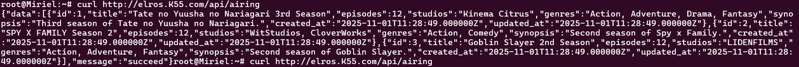

2.  **Pemeriksaan Log Worker (Troubleshooting)**:

    - **Masalah Awal**: Saat memvalidasi, `tail /var/log/nginx/access.log` di **Elendil** menunjukkan error `500 Internal Server Error`. Ini menandakan _worker_ Elendil gagal di-setup dengan benar.
    - **Perbaikan**: Masalah ini diatasi dengan menjalankan ulang skrip perbaikan Soal 7 di Elendil (terutama `composer update` dan `php artisan key:generate`).

3.  **Validasi Akhir (Pasca Perbaikan)**:

    - Tes `curl http://elendil.K55.com:8001/api/airing` (langsung ke Elendil) kini **berhasil** mengembalikan JSON.
    - Tes `tail /var/log/nginx/access.log` di Elendil, Isildur, dan Anarion setelah diakses menunjukkan log baru dengan status `200 OK`. Ini membuktikan bahwa ketiga _worker_ sudah sehat dan _load balancer_ Elros berfungsi penuh.

    |                  Log Elendil (Awalnya Error 500)                   |                      Log Isildur (Sehat)                      |                      Log Anarion (Sehat)                      |
    | :----------------------------------------------------------------: | :-----------------------------------------------------------: | :-----------------------------------------------------------: |
    | 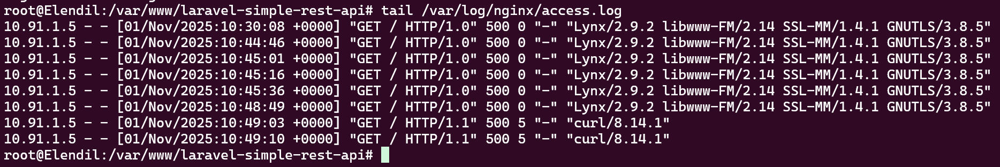 | 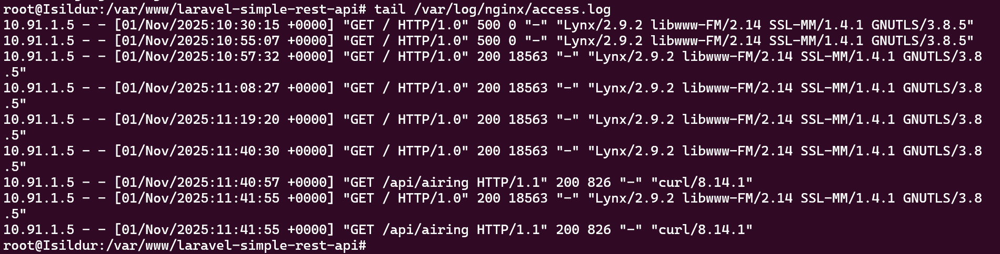 | 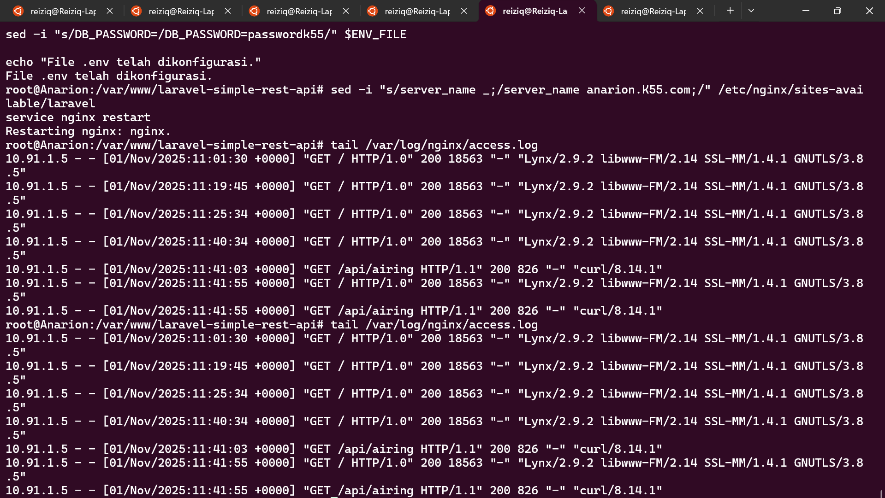 |

---

## 📦 Soal 11: Load Testing & Tuning (Elros)

> **Catatan:** Langkah-langkah pada soal ini belum dieksekusi atau divalidasi.

### **Soal 11: Penyampaian Ulang**

> Musuh mencoba menguji kekuatan pertahanan Númenor. Dari node client, luncurkan serangan benchmark (`ab`) ke `elros.K55.com/api/airing/`:
>
> - Serangan Awal: `-n 100 -c 10` (100 permintaan, 10 bersamaan).
> - Serangan Penuh: `-n 2000 -c 100` (2000 permintaan, 100 bersamaan).
>   Pantau kondisi para _worker_ dan periksa log Elros untuk melihat apakah ada _worker_ yang kewalahan atau koneksi yang gagal.
>   Strategi Bertahan: Tambahkan `weight` dalam algoritma, kemudian catat apakah lebih baik atau tidak.

### **🎯 Maksud dari Soal No. 11**

Tujuan dari soal ini adalah untuk melakukan **Load Testing** (uji beban) dan **Tuning** (penyetelan) pada _load balancer_ kita (Elros).

1.  **Load Testing**: Kita akan menggunakan _tool_ `ab` (Apache Benchmark) untuk mensimulasikan banyak klien yang mengakses Elros secara bersamaan. Tujuannya adalah untuk melihat seberapa baik sistem kita (Elros + 3 _worker_) menangani stres/beban tersebut.
2.  **Monitoring**: Sambil tes berjalan, kita akan memantau penggunaan CPU di **Elendil, Isildur, dan Anarion** menggunakan `htop` untuk melihat bagaimana Elros membagi beban. Kita juga akan memeriksa log error di Elros jika ada permintaan yang gagal.
3.  **Tuning (Strategi Bertahan)**: Setelah melihat hasil tes awal (Round Robin), kita akan memodifikasi algoritma _load balancing_ di Elros. Sesuai modul _Reverse Proxy_ , kita akan menambahkan `weight` (beban). Tujuannya adalah untuk melihat bagaimana perubahan strategi ini mempengaruhi kinerja (apakah jumlah permintaan yang gagal berkurang atau tidak).

### **🛠️ Cara Mengerjakan**

1.  **Persiapan Klien (Miriel)**: Install `apache2-utils` (yang berisi _tool_ `ab`) dan `htop` (untuk monitoring).
2.  **Persiapan Worker (Elendil, Isildur, Anarion)**: Install `htop` di ketiga _worker_ agar kita bisa memantau CPU mereka.
3.  **Jalankan Tes 1 (Serangan Awal)**:
    - Buka 4 jendela terminal: 1 untuk Miriel, 1 untuk Elendil, 1 untuk Isildur, 1 untuk Anarion.
    - Di 3 _worker_, jalankan `htop`.
    - Di **Miriel**, jalankan perintah `ab -n 100 -c 10 http://elros.K55.com/api/airing/`.
    - Amati `htop` di 3 _worker_ untuk melihat beban terdistribusi (seharusnya merata).
4.  **Jalankan Tes 2 (Serangan Penuh - Round Robin)**:
    - Masih dengan `htop` berjalan di _worker_.
    - Di **Miriel**, jalankan perintah `ab -n 2000 -c 100 http://elros.K55.com/api/airing/`.
    - Amati `htop` lagi dan catat jumlah `Failed requests` di output `ab`.
5.  **Terapkan Strategi Bertahan (Weight)**:
    - Di **Elros**, edit file konfigurasi Nginx (`/etc/nginx/sites-available/elros.K55.com`).
    - Ubah blok `upstream` untuk menambahkan `weight` ke _server_ (misal: `server 10.91.1.2:8001 weight=3;`).
    - Restart `nginx` di Elros.
6.  **Jalankan Tes 3 (Uji Coba Weight)**:
    - Jalankan lagi "Serangan Penuh" (`ab -n 2000 -c 100 ...`) di **Miriel**.
    - Amati `htop` dan bandingkan jumlah `Failed requests` dengan Tes 2.

### **✅ Cara Melakukan Validasi**

1.  **Validasi Round Robin**: Selama Tes 2, `htop` di ketiga _worker_ (Elendil, Isildur, Anarion) akan menunjukkan lonjakan penggunaan CPU yang relatif seimbang.
2.  **Validasi Weight**: Selama Tes 3, `htop` akan menunjukkan penggunaan CPU yang **tidak seimbang**. _Worker_ yang diberi `weight=3` akan menunjukkan CPU _load_ yang jauh lebih tinggi daripada _worker_ dengan `weight=1`. Ini membuktikan strategi _weight_ berfungsi.
3.  **Analisis Performa**: Bandingkan jumlah `Failed requests` dari output `ab` Tes 2 dengan Tes 3. Jika jumlah _fail_ berkurang, maka strategi `weight` dianggap "lebih baik".
4.  **Analisis Log**: Periksa file `/var/log/nginx/error.log` di **Elros**. Jika ada banyak _Failed requests_, log ini akan menunjukkan penyebabnya (misal, `worker_connections are not enough` atau `connect() failed`).

## 📦 Soal 12: Instalasi Web Server (Galadriel, Celeborn, Oropher)

### **Soal 12: Penyampaian Ulang**

> Para Penguasa Peri (Galadriel, Celeborn, Oropher) membangun taman digital mereka menggunakan PHP. Instal nginx dan php8.4-fpm di setiap node worker PHP. Buat file index.php sederhana di /var/www/html masing-masing yang menampilkan nama hostname mereka. Buat agar akses web hanya bisa melalui domain nama, tidak bisa melalui ip.

### **🎯 Maksud dari Soal No. 12**

Soal ini mengharuskan untuk melakukan instalasi Web Server menggunakan Nginx dan FPM, yang lalu membuat file `index.php` di `/var/www/html` yang menunjukan hostname server saat ini, dimana untuk ini akan dilakukan ke 3 node yaitu **Galadriel**, **Celeborn**, **Oropher**.

### **🛠️ Cara Mengerjakan**

Lakukan hal berikut untuk masing - masing node.

1. Install package

```sh
apt update
apt install nginx php php8.4-fpm -y
```

2. Buat file index.php dan isi script untuk menunjukan hostname

```sh
rm -rf /var/www/html/*
cat <<EOF > /var/www/html/index.php
<?php
echo "Hostname: " . gethostname() . "\n";
?>
EOF
```

### **✅ Cara Melakukan Validasi**

Karena ini adalah setup awal, maka cara melakukan validasi nya adalah dengan mengecek apakah package sudah terinstall dan file sudah terbuat untuk masing - masing node.

1. Service nginx dan fpm sudah berjalan

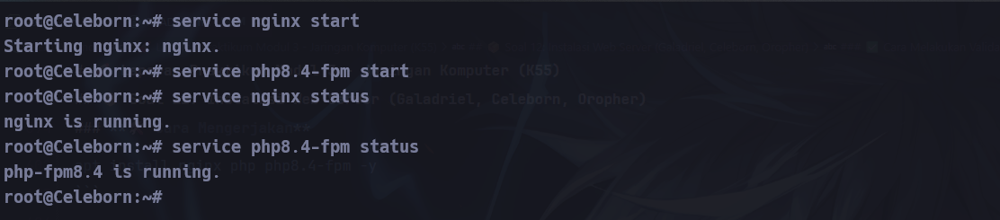

2. Cek apakah file index.php sudah terbuat


## 📦 Soal 13: Konfigurasi dan Menjalankan Web Server (Galadriel, Celeborn, Oropher)

### **Soal 13: Penyampaian Ulang**

> Setiap taman Peri harus dapat diakses. Konfigurasikan nginx di setiap worker PHP untuk meneruskan permintaan file .php ke socket php-fpm yang sesuai. Atur agar Galadriel mendengarkan di port 8004, Celeborn di 8005, dan Oropher di 8006.

### **🎯 Maksud dari Soal No. 13**

Soal ini mengharuskan untuk melakukan konfigurasi Nginx untuk masing - masing worker, dimana dengan konfigurasi port masing - masing, dan juga menggunakan FPM sebagai engine untuk dapat melakukan eksekusi kode php.

### **🛠️ Cara Mengerjakan**

1. Replace konfigurasi default dengan menggunakan script dibawah:

NOTE: Sesuaikan konfigurasi bagian **listen** dan **server_name** sesuai dengan port dan nama domain masing - masing node tersebut.

```sh
cat <<EOF > /etc/nginx/sites-available/default
server {
    listen 8004;
    server_name galadriel.k55.com;
    root /var/www/html;
    index index.php index.html index.htm;

    location / {
        try_files \$uri \$uri/ =404;
    }

    location ~ \.php\$ {
        include snippets/fastcgi-php.conf;
        fastcgi_pass unix:/var/run/php/php8.4-fpm.sock;
    }

    location ~ /\.ht {
        deny all;
    }
}

EOF
```

2. Restart nginx

```sh
service nginx restart
```

### **✅ Cara Melakukan Validasi**

Untuk melakukan validasi jalankan curl dari client manapun ke masing - masing node dengan domain yang berjalan:

```sh
curl http://galadriel.k55.com:8004
curl http://celeborn.k55.com:8005
curl http://oropher.k55.com:8006
```

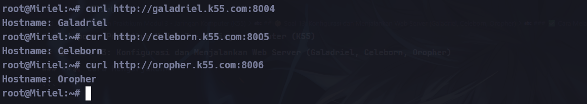

## 📦 Soal 14: Basic Authentication (Galadriel, Celeborn, Oropher)

### **Soal 14: Penyampaian Ulang**

> Keamanan adalah prioritas. Terapkan Basic HTTP Authentication pada nginx di setiap worker PHP, sehingga hanya mereka yang tahu kata sandi (user: noldor, pass: silvan) yang bisa masuk.

### **🎯 Maksud dari Soal No. 14**

Membuat autentikasi ketika ingin mengakses halaman yang akan diakses, yaitu dengan menggunakan Basic Authentication, dengan username nya adalah **noldor** dan password nya adalah **silvan**

### **🛠️ Cara Mengerjakan**

Lakukan langkah - langkah berikut ke setiap node yang ada.

1. Instalasi package

```sh
apt install apache2-utils -y
```

2. Melakukan generate auth file / htpasswd

```sh
htpasswd -bc /etc/nginx/.htpasswd noldor silvan
```

3. Menambahkan konfigurasi authentication

Tambahkan konfigurasi berikut di file `/etc/nginx/sites-available/default`

```conf
auth_basic "Restricted";
auth_basic_user_file /etc/nginx/.htpasswd;
```

Contoh:

```conf
server {
    listen 8004;
    server_name galadriel.k55.com;
    root /var/www/html;
    index index.php index.html index.htm;

    auth_basic "Restricted";                   # <- [Tambahan]
    auth_basic_user_file /etc/nginx/.htpasswd; # <- [Tambahan]

    location / {
        try_files $uri $uri/ =404;
    }

    location ~ \.php$ {
        include snippets/fastcgi-php.conf;
        fastcgi_pass unix:/var/run/php/php8.4-fpm.sock;
    }

    location ~ /\.ht {
        deny all;
    }
}
```

4. Restart nginx

```sh
service nginx restart
```

### **✅ Cara Melakukan Validasi**

1. Validasi ketika tidak memberikan username dan password

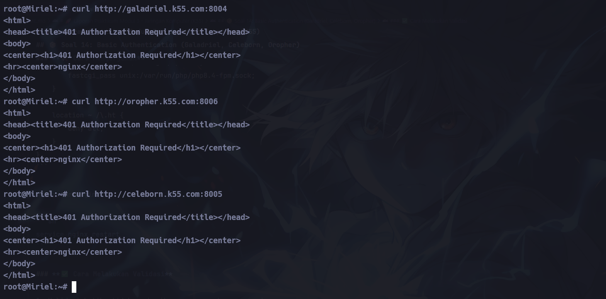

2. Validasi ketika username dan password diberikan dengan benar

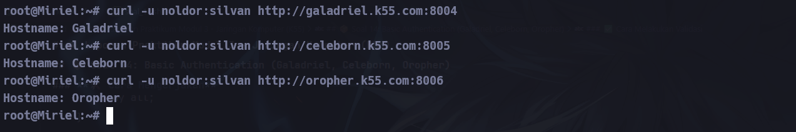

## 📦 Soal 15: Header X-Real-IP dan Tampilan Alamat IP (Galadriel, Celeborn, Oropher)

### **Soal 15: Penyampaian Ulang**

> Para Peri ingin tahu siapa yang mengunjungi taman mereka. Modifikasi konfigurasi Nginx di worker PHP untuk menambahkan header X-Real-IP yang akan diteruskan ke PHP. Ubah file index.php untuk menampilkan alamat IP pengunjung asli saat ini.

### **🎯 Maksud dari Soal No. 15**

Pada soal ini diharuskan untuk menambahkan header yang akan diproses oleh PHP yaitu **X-Real-IP**, dan nantinya pada bagian kode php harus menampilkan bagian IP dari header tersebut.

### **🛠️ Cara Mengerjakan**

Lakukan konfigurasi untuk setiap node yang ada.

1. Menambahkan **fastcgi_param** yang akan diteruskan ke engine FPM kemudian dapat diproses oleh PHP

Tambahkan konfigurasi berikut di file /etc/nginx/sites-available/default

```conf
map $http_x_real_ip $real_ip_or_remote {
    ""      $remote_addr;
    default $http_x_real_ip;
}

fastcgi_param HTTP_X_REAL_IP $real_ip_or_remote;
```

Contoh:

```conf
# [Tambahan]
map $http_x_real_ip $real_ip_or_remote {
    ""      $remote_addr;
    default $http_x_real_ip;
}

server {
    listen 8004;
    server_name galadriel.k55.com;
    root /var/www/html;
    index index.php index.html index.htm;

    auth_basic "Restricted";
    auth_basic_user_file /etc/nginx/.htpasswd;

    location / {
        try_files $uri $uri/ =404;
    }

    location ~ \.php$ {
        include snippets/fastcgi-php.conf;
        fastcgi_pass unix:/var/run/php/php8.4-fpm.sock;
        fastcgi_param HTTP_X_REAL_IP $remote_addr;       # <- [Tambahan]
    }

    location ~ /\.ht {
        deny all;
    }
}
```

2. Ubah isi kode PHP

```sh
cat <<EOF > /var/www/html/index.php
<?php
echo "Hostname: " . gethostname() . "\n";
echo "IP Address: " . \$_SERVER['HTTP_X_REAL_IP'] . "\n";
?>
EOF
```

3. Restart nginx

```sh
service nginx restart
```

### **✅ Cara Melakukan Validasi**

Lakukan curl dari client apapun dan lihat apakah ip yang keluar sesuai dengan alamat ip client tersebut, jika sama maka sudah berhasil.

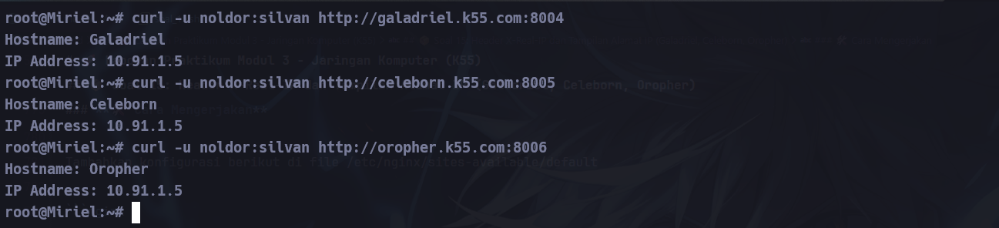

## 📦 Soal 16: Reverse Proxy (Pharazon)

### **Soal 16: Penyampaian Ulang**

> Raja Númenor terakhir yang ambisius, Pharazon, mencoba mengawasi taman-taman Peri. Konfigurasikan Nginx di Pharazon sebagai reverse proxy. Buat upstream Kesatria_Lorien berisi alamat ketiga worker PHP. Atur agar permintaan ke pharazon.<xxxx>.com diteruskan ke backend, dan pastikan konfigurasi Nginx di sPharazon juga meneruskan informasi Basic Authentication yang dimasukkan pengguna ke worker.

### **🎯 Maksud dari Soal No. 16**

Membuat web server pada node Pharazon yang bertugas sebagai Reverse Proxy untuk worker node sebelumnya yaitu Galadriel, Celeborn, Oropher. Pharazon juga bertugas sebagai load balancer yaitu dengan menggunakan `upstream` yang diteruskan ke masing - masing worker. Reverse Proxy ini juga harus bisa menghandle konfigurasi yang sudah ada di worker sebelumnya, seperti Basic Authentication.

### **🛠️ Cara Mengerjakan**

1. Install package

```sh
apt update
apt install nginx -y
```

2. Jalankan perintah berikut untuk membuat default config baru

```sh
cat <<EOF > /etc/nginx/sites-available/default
upstream Kesatria_Lorien {
    server 10.91.2.2:8004;
    server 10.91.2.3:8005;
    server 10.91.2.4:8006;
}

server {
    listen 80;
    server_name pharazon.k55.com;

    access_log /var/log/nginx/pharazon_access.log;
    error_log /var/log/nginx/pharazon_error.log;

    location / {
        proxy_pass http://Kesatria_Lorien;

        proxy_set_header Host \$host;
        proxy_set_header X-Real-IP \$remote_addr;
        proxy_set_header X-Forwarded-For \$proxy_add_x_forwarded_for;
        proxy_set_header X-Forwarded-Proto \$scheme;

        proxy_pass_header Authorization;
        proxy_set_header Authorization \$http_authorization;
    }
}

EOF
```

3. Restart nginx

```sh
service nginx restart
```

### **✅ Cara Melakukan Validasi**

Uji coba dari client apapun dan lihat responnya apakah sesuai atau tidak, dan lihat apakah respon worker nya sesuai, yaitu dengan melihat hostname nya. jalankan command berikut beberapa kali.

```sh
curl -u noldor:silvan pharazon.k55.com
```

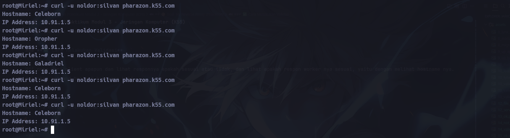

## 📦 Soal 17: Benchmark Proxy (Pharazon)

### **Soal 17: Penyampaian Ulang**

> Dari node client, lakukan benchmark ke pharazon.<xxxx>.com, jangan lupa menyertakan kredensial autentikasi. Amati distribusi beban ke para worker. Kemudian, simulasikan salah satu taman Peri runtuh (misal: service nginx stop di Galadriel) dan jalankan lagi benchmark. Apakah Pharazon masih bisa mengarahkan pengunjung ke taman yang tersisa? Periksa log Pharazon.

### **🎯 Maksud dari Soal No. 17**

Melakukan benchmarking atau load testing ke proxy dengan menggunakan Apache Benchmark untuk melihat bagaimana kondisi load balancer dari pharazon. Dan juga melakukan simulasi ketika salah satu worker mati, misal disini adalah worker dari node **Galadriel**

### **🛠️ Cara Mengerjakan**

Lakukan node client manapun

1. Install package benchmark jika belum ada

```sh
apt install apache2-utils -y
```

2. Menjalankan benchmark

```sh
ab -n 1000 -c 100 -A noldor:silvan http://pharazon.k55.com
```

Perintah diatas akan melakukan total 1000 request, dan 100 request akan dilakukan bersamaan.

3. Matikan salah satu worker (Galadriel)

```sh
service nginx stop
```

### **✅ Cara Melakukan Validasi**

1. Validasi ketika semua worker berjalan normal
   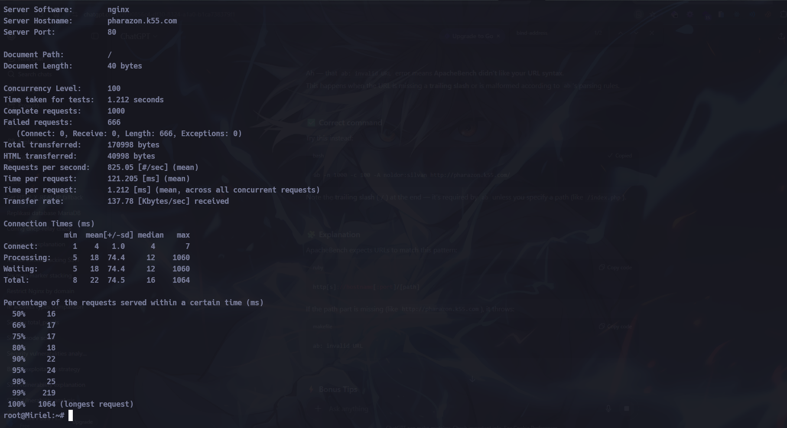
   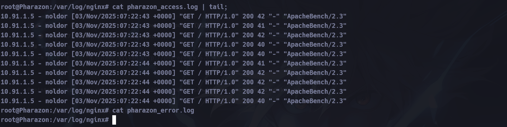

2. Validasi ketika salah satu worker mati (Galadriel)
   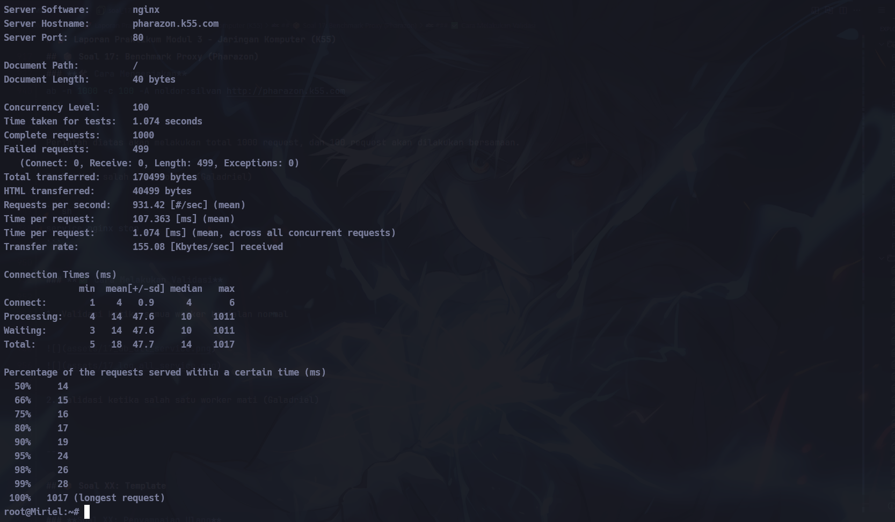
   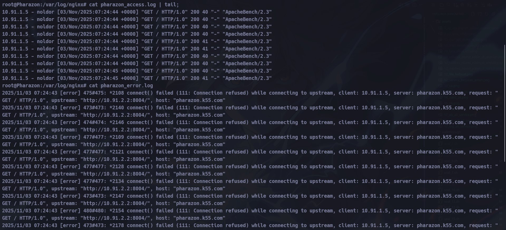

## 📦 Soal 18: Database Replicatoin (Palantir, Narvi)

### **Soal 18: Penyampaian Ulang**

> Kekuatan Palantir sangat vital. Untuk melindunginya, konfigurasikan replikasi database Master-Slave menggunakan MariaDB. Jadikan Palantir sebagai Master. Konfigurasikan Narvi sebagai Slave yang secara otomatis menyalin semua data dari Palantir. Buktikan replikasi berhasil dengan membuat tabel baru di Master dan memeriksanya di Slave.

### **🎯 Maksud dari Soal No. 18**

Soal ini mengharuskan untuk membuat infrastruktur untuk Database Replication, dimana disini Palantir akan bertindak sebagai Master, dan Narvi akan bertindak sebagai Slave. Keduanya harus saling terhubung dan sinkron satu dengan yang lain.

### **🛠️ Cara Mengerjakan**

1. Install package (Palantir & Narvi)

```sh
apt update
apt install mariadb-server -y
```

2. Konfigurasi Palantir

   - Ubah file `/etc/mysql/mariadb.conf.d/50-server.cnf`, dan cari, ganti, dan atau tambahkan beberapa config berikut ini
     ```conf
     [mariadb]
     server-id=1
     log_bin=/var/log/mysql/mysql-bin.log
     bind-address=0.0.0.0
     ```
   - Buat direktori untuk log

     ```sh
     mkdir -p /var/log/mysql
     chown -R mysql:mysql /var/log/mysql
     chmod 750 /var/log/mysql
     ```

   - Restart service mariadb

     ```sh
     service mariadb restart
     ```

   - Konfigurasi user dan master database

     ```sh
        mysql -u root <<EOF
        CREATE USER 'palantir'@'%' IDENTIFIED BY 'palantir123';
        GRANT REPLICATION SLAVE ON *.* TO 'palantir'@'%';
        FLUSH PRIVILEGES;

        FLUSH TABLES WITH READ LOCK;
        SHOW MASTER STATUS;
        EOF
     ```

3. Konfigurasi Narvi

   - Ubah file `/etc/mysql/mariadb.conf.d/50-server.cnf`, dan cari, ganti, dan atau tambahkan beberapa config berikut ini

     ```conf
     [mariadb]
     server-id=2
     relay-log=/var/log/mysql/relay-bin.log
     ```

   - Buat direktori untuk log

     ```sh
     mkdir -p /var/log/mysql
     chown -R mysql:mysql /var/log/mysql
     chmod 750 /var/log/mysql
     ```

   - Konfigurasi slave

     ```sh
     mysql -u root <<EOF
     CHANGE MASTER TO
     MASTER_HOST='10.91.4.3',
     MASTER_USER='palantir',
     MASTER_PASSWORD='palantir123',
     MASTER_LOG_FILE='mysql-bin.000001',
     MASTER_LOG_POS=777;

     START SLAVE;

     SHOW SLAVE STATUS\G
     EOF
     ```

### **✅ Cara Melakukan Validasi**

Untuk melakukan validasi dapat mencoba untuk melakukan manipulasi database pada Palantir, dan seharusnya perubahannya akan diikuti oleh Narvi.

1. Membuat database dan table dan insert value di Palantir

   ```sql
   CREATE DATABASE jarkom;
   USE jarkom;
   CREATE TABLE test (id INT PRIMARY KEY, name VARCHAR(50));
   INSERT INTO test (id, name) VALUES (1, 'Jarkom');
   ```

   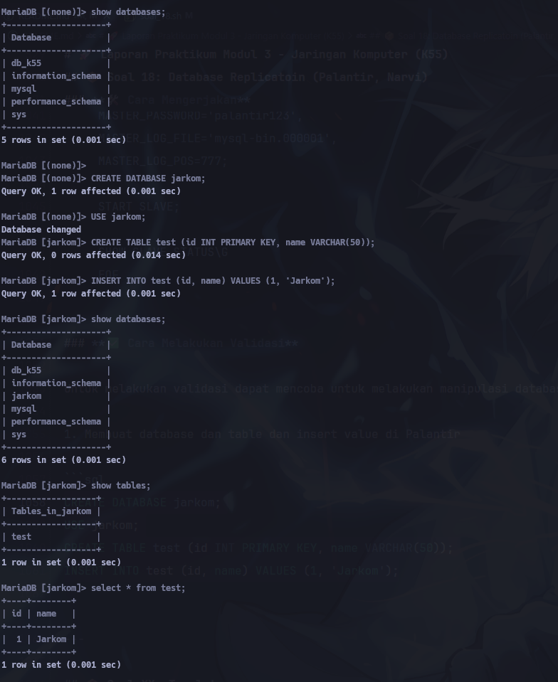

2. Validasi apakah di Narvi juga terdapat data yang sama.

   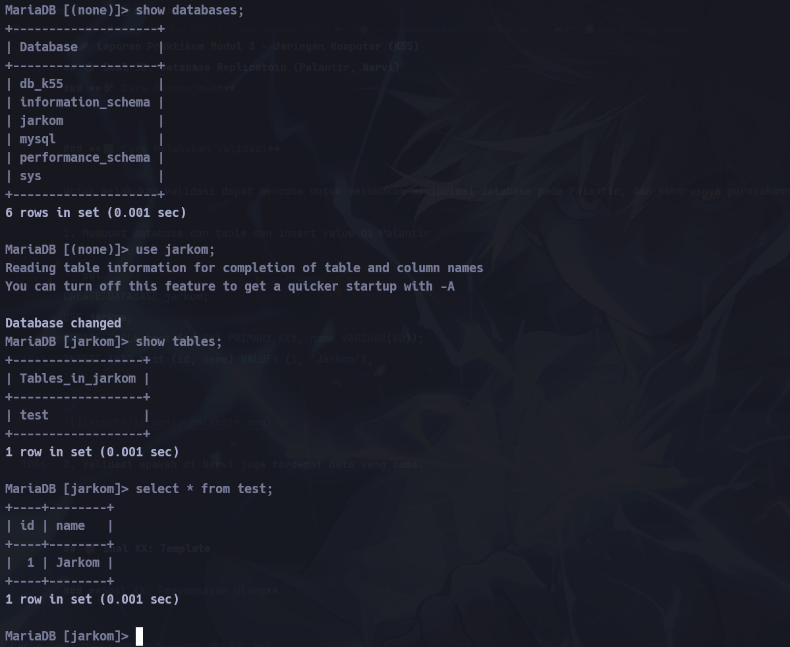

## 📦 Soal 19: Rate Limiter (Elros, Pharazon)

### **Soal 19: Penyampaian Ulang**

> Gelombang serangan dari Mordor semakin intens. Implementasikan rate limiting pada kedua Load Balancer (Elros dan Pharazon) menggunakan Nginx. Batasi agar satu alamat IP hanya bisa melakukan 10 permintaan per detik. Uji coba dengan menjalankan ab dari satu client dengan konkurensi tinggi (-c 50 atau lebih) dan periksa log Nginx untuk melihat pesan request yang ditolak atau ditunda karena rate limit.

### **🎯 Maksud dari Soal No. 19**

Menambahkan rate limiter untuk setiap proxy atau load balancer yang ada yaitu pada Elros dan Pharazon, dengan cara mengubah konfigurasi Nginx dari masing - masing node tersebut.

### **🛠️ Cara Mengerjakan**

1. Ubah config masing - masing node dan tambahkan bagian berikut ini:

Bagian paling atas dari config.

```conf
limit_req_zone $binary_remote_addr zone=limit_zone:10m rate=10r/s;
```

Bagian scope path yaitu `location /`

```conf
limit_req zone=limit_zone burst=20 nodelay;
```

2. Restart nginx

```sh
service nginx restart
```

### **✅ Cara Melakukan Validasi**

Jalankan perintah berikut dari node client manapun

```sh
ab -n 100 -c 50 http://pharazon.k55.com/
ab -n 100 -c 50 http://elros.k55.com/api/airing/
```

1. Hasil dari Pharazon
   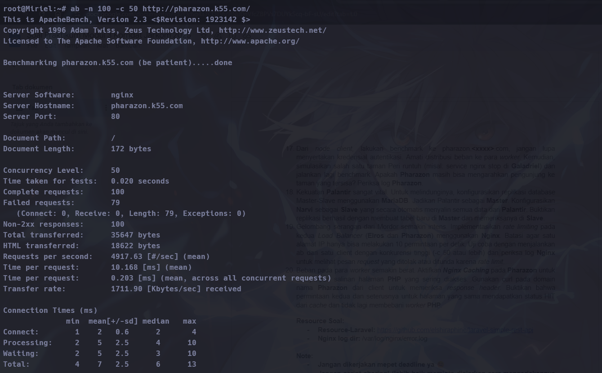
   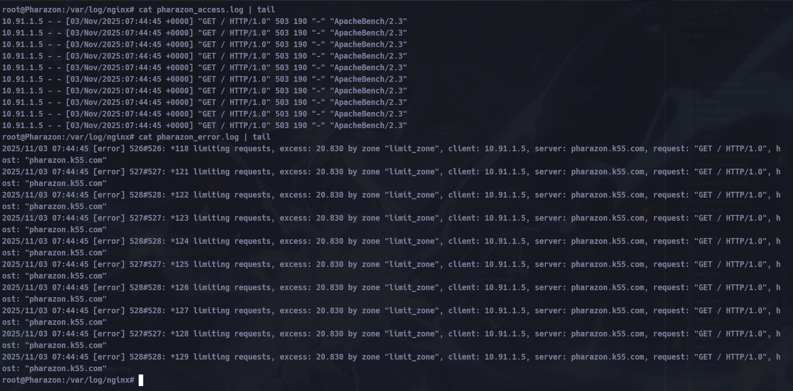

2. Hasil dari Elros
   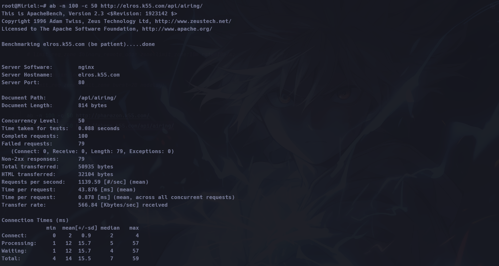
   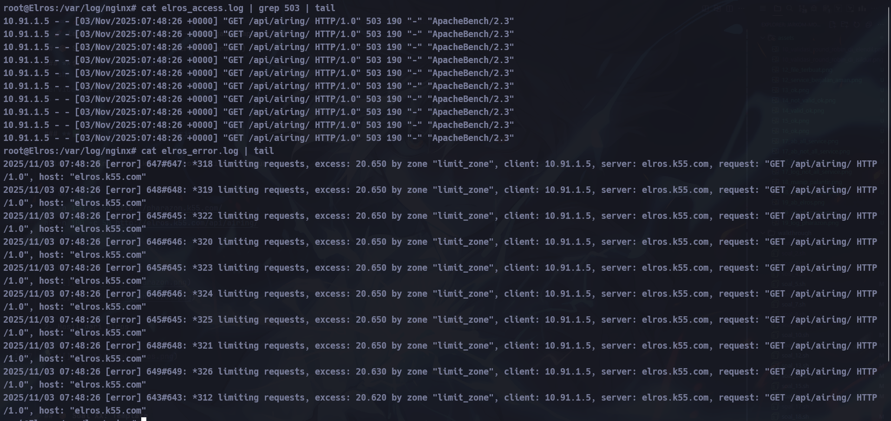

## 📦 Soal 20: Cache (Pharazon)

### **Soal 20: Penyampaian Ulang**

> Beban pada para worker semakin berat. Aktifkan Nginx Caching pada Pharazon untuk menyimpan salinan halaman PHP yang sering diakses. Gunakan curl pada domain nama Pharazon dari client untuk memeriksa response header. Buktikan bahwa permintaan kedua dan seterusnya untuk halaman yang sama mendapatkan status HIT dari cache dan tidak lagi membebani worker PHP.

### **🎯 Maksud dari Soal No. 20**

Membuat cache untuk setiap akses yang ada pada node Elros dan Pharazon.

### **🛠️ Cara Mengerjakan**

1. Ubah konfigurasi dari Pharazon, menjadi berikut ini

```conf
proxy_cache_path /var/cache/nginx levels=1:2 keys_zone=pharazon_cache:100m inactive=60m use_temp_path=off;
proxy_cache_key "$scheme$request_method$host$request_uri";

limit_req_zone $binary_remote_addr zone=limit_zone:10m rate=10r/s;

upstream Kesatria_Lorien {
    server galadriel.k55.com:8004;
    server celeborn.k55.com:8005;
    server oropher.k55.com:8006;
}

server {
    listen 80;
    server_name pharazon.k55.com;

    proxy_cache pharazon_cache;
    proxy_cache_valid 200 302 2m;
    proxy_cache_valid 404 1m;


    location / {
        limit_req zone=limit_zone burst=20 nodelay;

        proxy_cache pharazon_cache;
        proxy_cache_valid 200 302 2m;
        proxy_cache_valid 404 1m;
        add_header X-Cache-Status $upstream_cache_status;

        proxy_pass http://Kesatria_Lorien;

        proxy_set_header Host $host;
        proxy_set_header X-Real-IP $remote_addr;
        proxy_set_header X-Forwarded-For $proxy_add_x_forwarded_for;
        proxy_set_header X-Forwarded-Proto $scheme;

        proxy_pass_header Authorization;
        proxy_set_header Authorization $http_authorization;
    }
}
```

2. Restart nginx

```sh
service nginx restart
```

### **✅ Cara Melakukan Validasi**

Jalankan di node client manapun

```sh
curl -u noldor:silvan http://pharazon.k55.com -v
```

1. First try

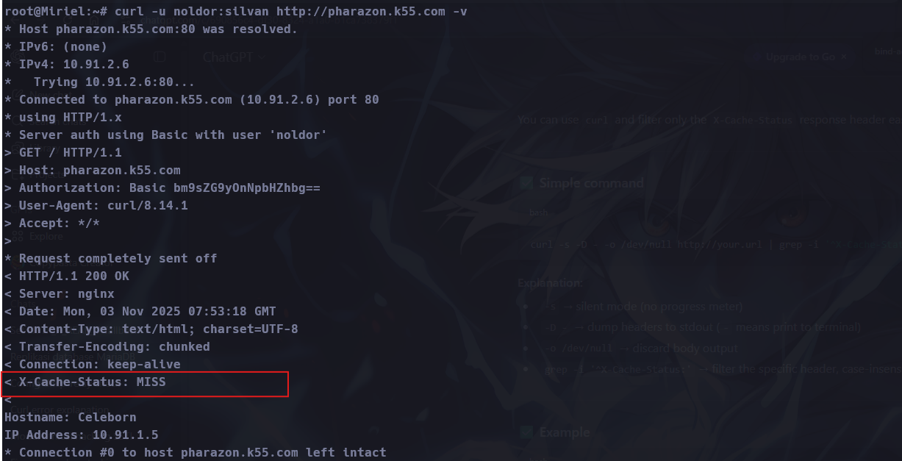

2. Next try

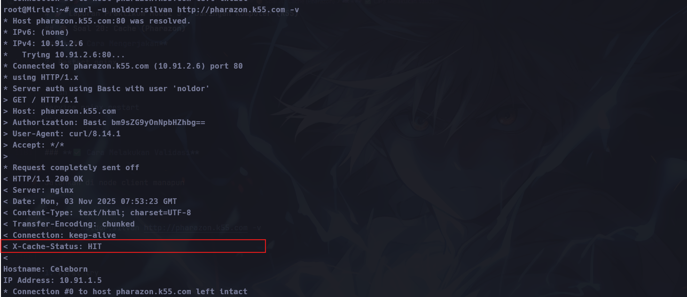
